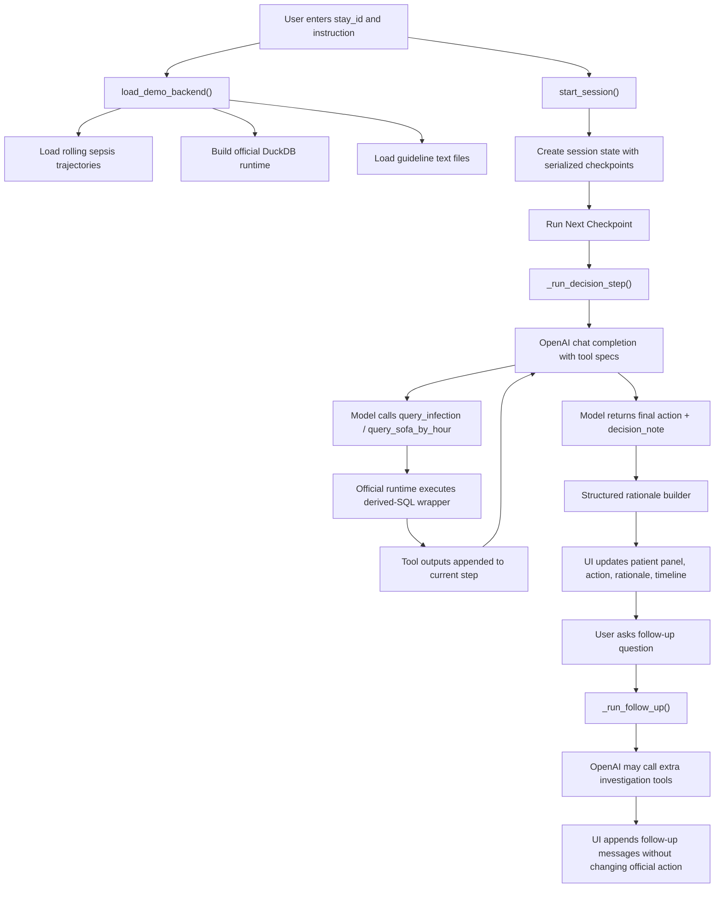

# Gradio Monitoring Demo Pipeline

## Scope

This document describes the Gradio-based interactive monitoring console added for the rolling sepsis demo.

The goal of this demo is different from the benchmark runner:

- the benchmark runner is optimized for batch rollouts and evaluation
- the Gradio demo is optimized for interactive inspection of one ICU stay at a time

The demo still uses the same core benchmark assumptions:

- rolling checkpoint monitoring, not forecasting
- partial observability up to the current checkpoint only
- single-task sepsis action space:
  - `keep_monitoring`
  - `infection_suspect`
  - `trigger_sepsis_alert`
- official concept-layer tool outputs from derived SQL wrappers

The implementation lives in:

- demo app: [src/sepsis_mvp/gradio_demo.py](/Users/chloe/Documents/New project/src/sepsis_mvp/gradio_demo.py)
- dataset loader: [src/sepsis_mvp/dataset.py](/Users/chloe/Documents/New project/src/sepsis_mvp/dataset.py)
- official runtime/tool wrappers: [src/sepsis_mvp/tools.py](/Users/chloe/Documents/New project/src/sepsis_mvp/tools.py)
- shared schemas: [src/sepsis_mvp/schemas.py](/Users/chloe/Documents/New project/src/sepsis_mvp/schemas.py)
- guideline files: [clinical_guidelines](/Users/chloe/Documents/New project/clinical_guidelines)

## Design Goal

The demo is meant to answer a different set of questions from the CLI runner:

- what does the agent do on a specific stay?
- what evidence is visible at the current checkpoint?
- why did the agent choose this action?
- what happens if a user asks for further investigation?

So the app is intentionally built around:

- one stay at a time
- one checkpoint at a time
- transparent tool calls
- structured rationale
- optional follow-up investigation after the official checkpoint decision

## Supported Scope Right Now

The current demo is intentionally narrow.

It supports:

- single-task sepsis trajectories only
- checkpoint times taken directly from the rolling sepsis dataset
- `official` tool backend only
- OpenAI-backed checkpoint decisions
- interactive follow-up questions using a small approved tool set

It does not currently support:

- multitask monitoring in the Gradio UI
- zero-shot raw execution in the Gradio UI
- autoformalized tools in the Gradio UI
- queueing multiple stays simultaneously
- editing checkpoint labels or saving annotations

## Inputs and External Requirements

The demo needs three core inputs:

1. rolling sepsis dataset
2. DuckDB with `mimiciv_derived.*` relations
3. guideline directory

Typical launch command:

```bash
export OPENAI_API_KEY="your_api_key_here"

PYTHONPATH=src python3 -m sepsis_mvp.gradio_demo \
  --dataset rolling_monitor_dataset/sepsis/rolling_sepsis.csv \
  --db-path /Users/chloe/Desktop/healthcare/mimic-iv-3.1/buildmimic/duckdb/mimic4_dk.db \
  --guideline-dir clinical_guidelines
```

The relevant files in this repo are:

- dataset: [rolling_monitor_dataset/sepsis/rolling_sepsis.csv](/Users/chloe/Documents/New project/rolling_monitor_dataset/sepsis/rolling_sepsis.csv)
- guideline files:
  - [clinical_guidelines/sepsis_concise_summary.txt](/Users/chloe/Documents/New project/clinical_guidelines/sepsis_concise_summary.txt)
  - [clinical_guidelines/aki_concise_summary.txt](/Users/chloe/Documents/New project/clinical_guidelines/aki_concise_summary.txt)
  - [clinical_guidelines/aki_advanced_concise_summary.txt](/Users/chloe/Documents/New project/clinical_guidelines/aki_advanced_concise_summary.txt)

## High-Level Architecture



## Data Model

There are two distinct layers of state:

### 1. Backend static state

Owned by `DemoBackend` in [src/sepsis_mvp/gradio_demo.py](/Users/chloe/Documents/New project/src/sepsis_mvp/gradio_demo.py).

It contains:

- `dataset_path`
- `db_path`
- `guideline_dir`
- `runtime`
- `trajectories_by_stay`
- `guideline_documents`

This state is cached by `load_demo_backend()` so we do not rebuild the dataset/runtime on every button click.

### 2. Per-user Gradio session state

Owned by a plain dict stored in `gr.State`.

It contains:

- selected `stay_id`
- monitoring instruction
- patient summary
- serialized checkpoint list
- completed step records
- `next_step_index`

The important design choice here is:

- the session checkpoint list is serialized into plain dicts
- it does not keep live `Checkpoint` dataclass objects

This makes the session easier for Gradio to store and re-render, but it also means helper functions must treat checkpoints as dicts, not dataclass instances.

## Dataset Layer

The demo reuses the ordinary rolling sepsis CSV rather than inventing a new UI-only dataset.

Loading happens through:

- [src/sepsis_mvp/dataset.py](/Users/chloe/Documents/New project/src/sepsis_mvp/dataset.py)
- `load_dataset_auto()`

The demo then filters trajectories to:

- single-task
- primary task = `sepsis`

Checkpoint timing comes directly from the dataset.

For example, for stay `30157290`, the dataset encodes:

- `t=0`
- `t=4`
- `t=8`
- `t=12`
- `t=16`
- `t=20`
- `t=24`

The demo does not synthesize new checkpoint times on the fly.

## Guideline Layer

Guidelines are loaded from the filesystem rather than embedded in the code.

Current loader behavior:

- read every file in `clinical_guidelines/`
- store them as `GuidelineDocument`
- expose:
  - combined markdown for the UI
  - sepsis-focused text for the decision prompt
  - combined guidance text for investigation prompts

This design keeps the demo flexible:

- new text guideline files can be dropped in without changing code
- the UI can show all guideline sources
- the agent can consume a compact summary instead of a huge raw document blob

## Tool Layer

The demo does not expose runtime tool names directly to the model.

Instead it defines UI/demo-friendly tool aliases:

- `query_infection`
- `query_sofa_by_hour`
- `query_aki_by_hour`

These aliases map onto the official runtime wrappers:

- `query_infection` -> `query_suspicion_of_infection`
- `query_sofa_by_hour` -> `query_sofa`
- `query_aki_by_hour` -> `query_kdigo_stage`

This mapping is defined in `TOOL_ALIAS_CONFIG` in [src/sepsis_mvp/gradio_demo.py](/Users/chloe/Documents/New project/src/sepsis_mvp/gradio_demo.py).

The separation is useful because:

- the UI can use friendlier names
- the runtime can stay aligned with the benchmark code
- prompt wording can be tailored without changing the tool backend

## Two Agent Modes

The demo intentionally separates the model into two interaction modes.

### 1. Official checkpoint decision mode

This is used when the user clicks:

- `Run Next Checkpoint`
- `Run To End`

Behavior:

- model must call both:
  - `query_infection`
  - `query_sofa_by_hour`
- then return final JSON:

```json
{"action":"infection_suspect","decision_note":"Visible infection but SOFA remains below alert threshold."}
```

The decision step is strict because it represents the benchmark-facing action for that checkpoint.

### 2. Follow-up investigation mode

This is used when the user asks a follow-up question after a checkpoint decision is already present.

Behavior:

- model may call a slightly broader tool set:
  - `query_infection`
  - `query_sofa_by_hour`
  - `query_aki_by_hour`
- model returns ordinary markdown/text, not JSON
- the official checkpoint action is not silently changed

This was a deliberate design choice.

It keeps the demo interpretable:

- one official action per checkpoint
- extra questions stay in the “explain/investigate” lane
- users can inspect more evidence without blurring the benchmark record

## OpenAI Control Loop

The OpenAI interaction is implemented in `_run_openai_tool_loop()` in [src/sepsis_mvp/gradio_demo.py](/Users/chloe/Documents/New project/src/sepsis_mvp/gradio_demo.py).

The loop works as follows:

1. send system prompt + current payload to OpenAI
2. allow model to emit tool calls
3. execute those tool calls through the official runtime
4. append tool outputs back into the message list
5. repeat until:
   - final JSON is returned for a checkpoint decision, or
   - final text is returned for a follow-up answer

Guardrails:

- max rounds = `MAX_AGENT_ROUNDS`
- decision mode enforces required tool use before final action
- tool names are restricted to the approved alias set
- each executed tool is pinned to the active `stay_id` and current `t_hour`

This is important:

- the model cannot use arbitrary patient ids
- the model cannot move itself to a future checkpoint

## Checkpoint Decision Flow

The decision path is:

1. user clicks `Run Next Checkpoint`
2. `run_next_checkpoint()` reads `session["next_step_index"]`
3. `_run_decision_step()` builds the checkpoint payload
4. OpenAI receives:
   - monitoring instruction
   - patient summary
   - current checkpoint info
   - prior actions
   - required tool names
5. model calls:
   - `query_infection`
   - `query_sofa_by_hour`
6. the demo executes the tools via `DemoBackend.runtime`
7. model returns:
   - one final action
   - one short `decision_note`
8. `_build_structured_rationale()` creates a UI-friendly rationale object
9. session state is updated with the finished step record
10. timeline and status panels re-render

## Structured Rationale Design

The rationale object is intentionally deterministic and UI-friendly.

It includes:

- `infection_status`
- `organ_dysfunction_status`
- `key_supporting_evidence`
- `key_missing_evidence`
- `why_not_keep_monitoring`
- `why_not_infection_suspect`
- `why_not_trigger_sepsis_alert`
- `recommended_next_checks`
- `decision_note`

This is not meant to be a complete clinical explanation.

It is meant to make the action inspectable in a stable way even when model wording changes.

## Follow-Up Flow

When a user asks a follow-up question:

1. the latest completed step is loaded
2. the model receives:
   - current checkpoint metadata
   - official action already taken
   - rationale
   - decision tool outputs
   - prior follow-up turns for this checkpoint
3. model may call infection / SOFA / AKI investigation tools
4. model returns a normal text answer
5. answer and investigation tool outputs are appended to `investigation_turns`
6. the chatbot panel re-renders from session state

This is separate from the checkpoint action log.

The timeline remains stable even if a follow-up answer explores more context.

## UI Layout

The current Gradio app is organized into:

- top config row
  - dataset path
  - DuckDB path
  - guideline directory
- OpenAI config row
  - API key
  - model
- session setup row
  - stay id
  - monitoring instruction
- control buttons
  - `Start Session`
  - `Run Next Checkpoint`
  - `Run To End`
  - `Reset`
- status line
- main panels
  - patient context
  - current checkpoint
  - action
  - structured rationale
  - cumulative evidence
  - current step tool activity
- bottom panels
  - checkpoint timeline
  - follow-up chatbot
  - guidelines accordion
  - raw session JSON

This layout is intentionally closer to a monitoring console than to a chat-first assistant.

## Session Lifecycle

### Start session

`start_session()`:

- loads backend
- validates `stay_id`
- extracts one trajectory
- serializes checkpoints into dicts
- stores patient metadata and session instruction

### Run next checkpoint

`run_next_checkpoint()`:

- resolves current checkpoint from `next_step_index`
- calls `_run_decision_step()`
- appends one step record
- increments `next_step_index`

### Run all checkpoints

`run_all_checkpoints()`:

- repeatedly calls `_run_decision_step()`
- stops at end of trajectory

### Ask follow-up question

`ask_follow_up_question()`:

- requires at least one completed step
- calls `_run_follow_up()`
- appends an investigation turn to the latest step

### Reset

`reset_session()`:

- clears session state
- reloads guideline markdown for display

## Compatibility Notes

This repo currently runs against Gradio `6.6.0` in the tested environment.

That matters because:

- `Chatbot` expects message-style history by default
- `Chatbot(type="messages")` is not accepted in this environment
- custom `css` should be passed to `launch()` rather than `Blocks(...)`

The current implementation is aligned to that behavior.

## Bugs Found and Fixed During Build

Several UI/runtime bugs were found while stabilizing the demo.

### 1. Serialized checkpoint dict vs dataclass mismatch

Symptom:

- `Checkpoint run failed: 'dict' object has no attribute 't_hour'`

Cause:

- checkpoints in session state are serialized dicts
- `_decision_user_payload()` was still using dataclass-style access

Fix:

- switch to dict access:
  - `checkpoint["t_hour"]`
  - `checkpoint.get("checkpoint_time")`
  - `checkpoint.get("state_label")`

### 2. Chatbot history format mismatch

Symptom:

- Gradio raised:
  `"Data incompatible with messages format..."`

Cause:

- chatbot history was returned as old tuple pairs instead of message dicts

Fix:

- convert chat history into:
  - `{"role": "user", "content": "..."}`
  - `{"role": "assistant", "content": "..."}`

### 3. Unsupported `Chatbot(type="messages")` argument

Symptom:

- `TypeError: Chatbot.__init__() got an unexpected keyword argument 'type'`

Cause:

- this environment already uses messages-format chat history by default
- but the constructor does not expose a `type=` argument

Fix:

- remove `type="messages"`
- keep message-dict history format

### 4. CSS warning on startup

Symptom:

- Gradio warned that `css` had moved from `Blocks(...)` to `launch()`

Fix:

- keep `Blocks(title=...)`
- store CSS on the demo object
- pass CSS during `launch(...)`

## Smoke-Test Checklist

The demo has been smoke-tested locally at several levels.

### Static checks

```bash
python -m py_compile src/sepsis_mvp/gradio_demo.py tests/test_gradio_demo.py
PYTHONPATH=src python -m unittest discover -s tests -p 'test_gradio_demo.py'
```

### Backend smoke tests

Verified locally:

- backend loads against the real DuckDB
- rolling sepsis dataset loads
- session initializes for a real `stay_id`
- official tools return expected checkpoint-scoped values

Example checkpoint evidence for stay `30157290` at `t=4`:

- `query_infection`: suspected infection visible
- `query_sofa_by_hour`: latest SOFA = `1`
- `query_aki_by_hour`: no AKI

### Gradio launch smoke test

Verified:

- app launches successfully
- local page returns `HTTP 200 OK`

Because local socket binding is restricted inside the sandboxed coding environment, browser-level launch verification required running the server outside the sandbox.

## Why This Demo Is Structured This Way

The key design choice is that the demo is not just “the benchmark runner with a UI.”

Instead it deliberately separates:

- official checkpoint action generation
- optional exploratory follow-up investigation

This gives three benefits:

1. the checkpoint timeline remains stable and benchmark-aligned
2. the user can still ask rich questions
3. the UI does not collapse into one long, hard-to-interpret chat transcript

That tradeoff makes the demo a better tool for:

- model inspection
- stakeholder demos
- debugging tool use
- clinical reasoning walkthroughs

without needing to rewrite the benchmark core.

## Suggested Next Extensions

The most natural next upgrades are:

1. add a `Re-evaluate Current Checkpoint` button
2. let users select stay ids from a dropdown populated from the dataset
3. add a compact trend panel across checkpoints
4. support multitask mode in the Gradio console
5. persist session transcripts or export a checkpoint report
6. add a small model-observability panel:
   - tool latency
   - total tool calls
   - prompt/response summaries

## Summary

The Gradio demo reuses the existing rolling sepsis benchmark data and official concept-tool wrappers, but wraps them in an interactive single-stay console.

At a high level:

- data comes from the rolling sepsis dataset
- tool evidence comes from official derived SQL wrappers
- OpenAI produces the checkpoint decision and follow-up investigation behavior
- rationale is rendered in a stable structured format
- the UI keeps official checkpoint actions separate from exploratory chat

That makes the demo faithful to the benchmark contract while still being useful as an interactive monitoring console.
