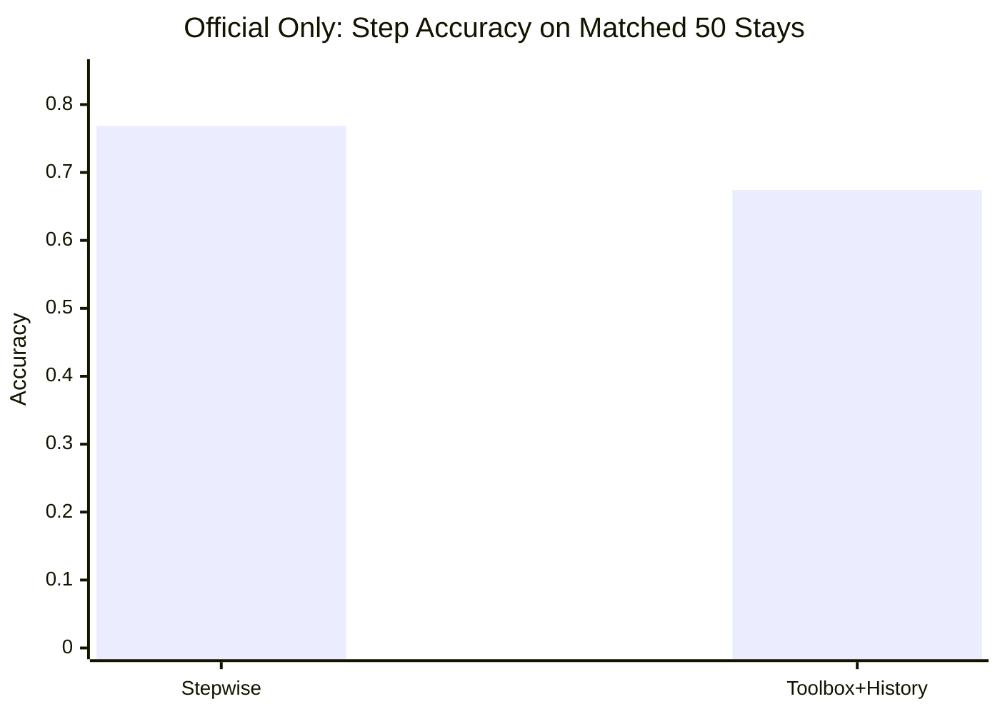
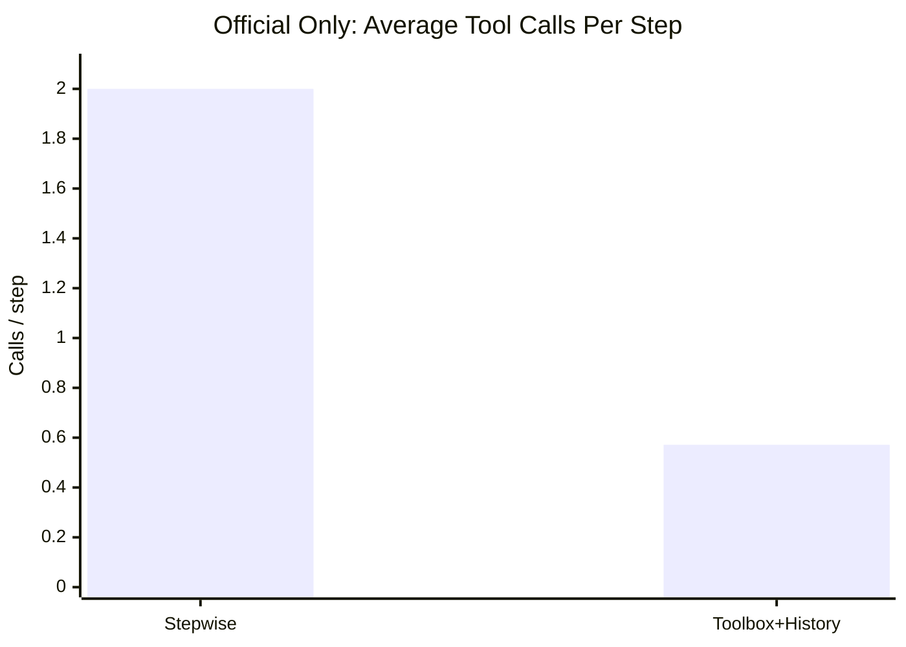
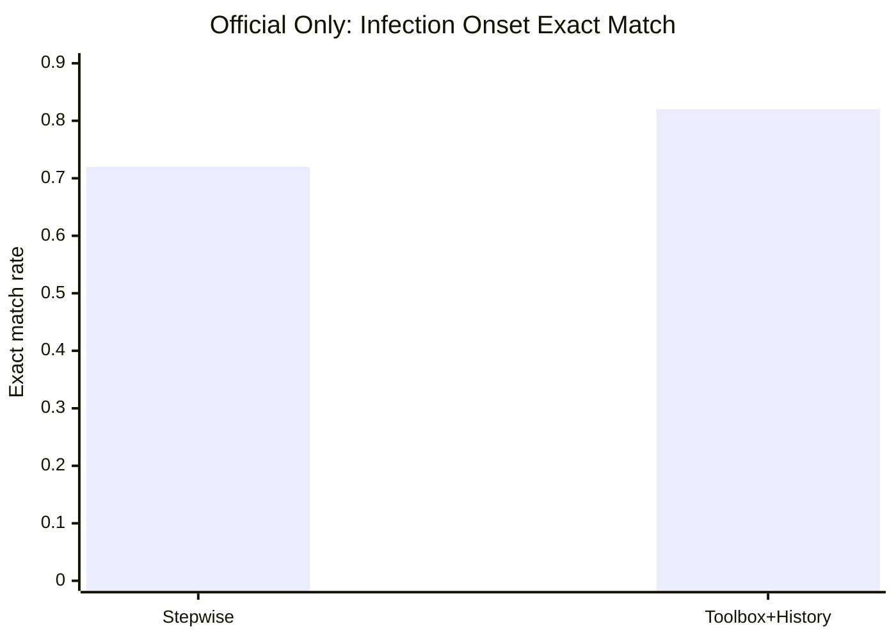
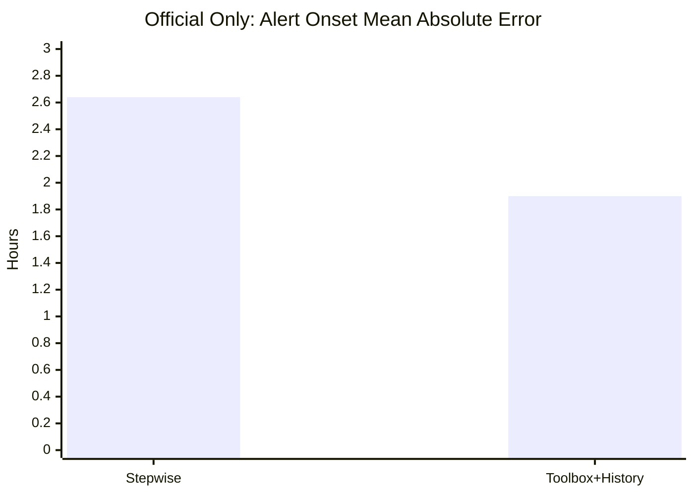
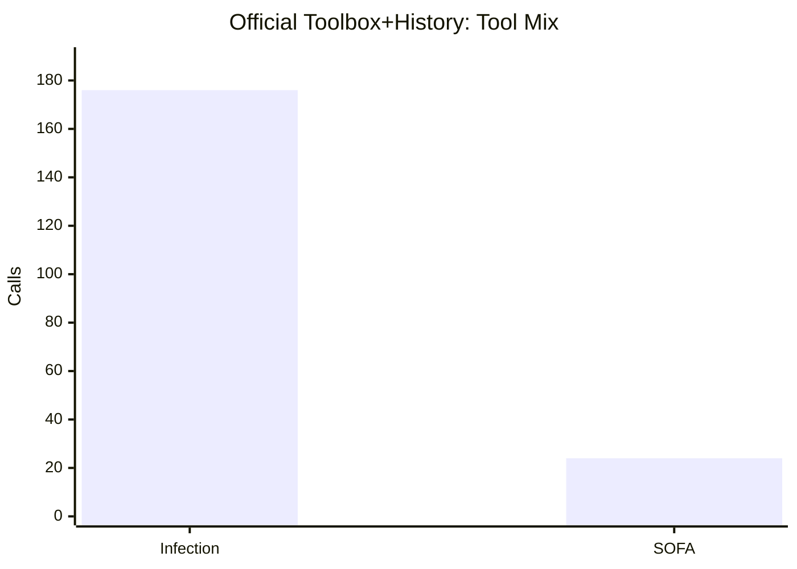
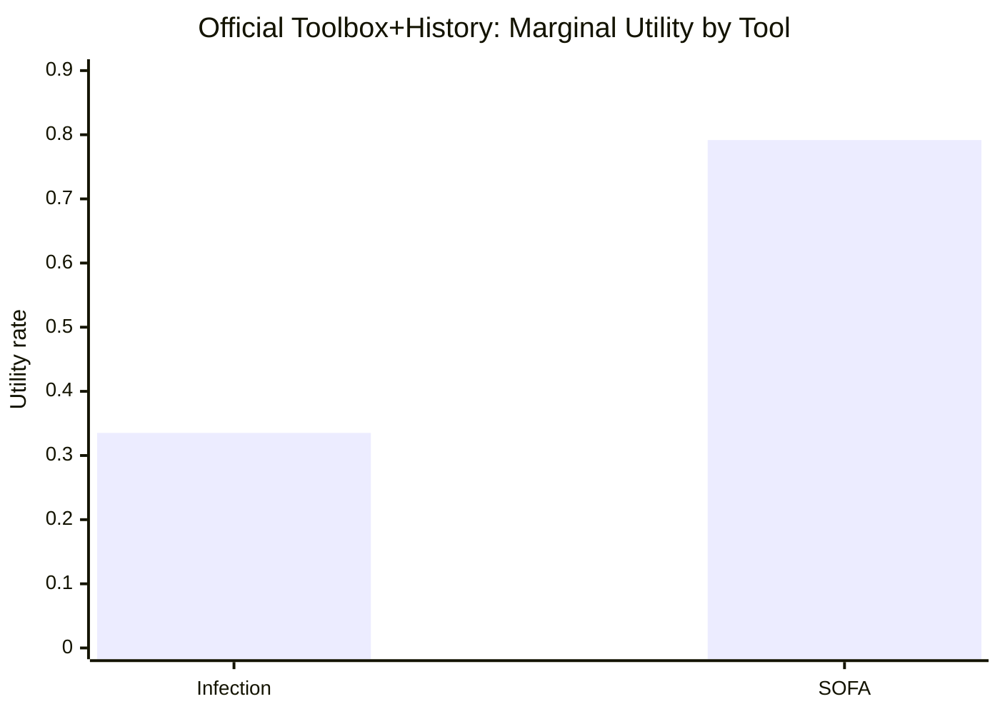

# Official Sepsis: Stepwise Tool Calling vs Toolbox With History

This note compares two **official-backend** single-sepsis runs with the same model family:

1. [official_single_sepsis_Qwen3-30B-A3B-Instruct-2507](/Users/chloe/Documents/New project/result/official_single_sepsis_Qwen3-30B-A3B-Instruct-2507)
2. [sepsis_toolbox_history_official_qwen3_30b](/Users/chloe/Documents/New project/result/sepsis_toolbox_history_official_qwen3_30b)

The main question is not only which one is more accurate. It is whether the toolbox-with-history version behaves like a **real longitudinal task** and whether the extra tool-use metrics are informative.

## Executive Summary

- The old stepwise setting is **not a real longitudinal monitoring task** in practice.
  It always calls both tools at every checkpoint:
  - `query_suspicion_of_infection`
  - `query_sofa`
- The toolbox-with-history setting **is a real longitudinal task**.
  It uses history, skips many tool calls, and turns tool-use behavior into something we can actually evaluate.
- On a fair **matched 50-stay cohort**, the toolbox-with-history run:
  - uses `71.4%` fewer tool calls per step
  - makes no tool call on `42.86%` of steps
  - improves infection onset timing substantially
  - improves alert timing precision
  - but loses step-level classification accuracy and misses more true alerts

So the tradeoff is:

- `official_single_sepsis`: stronger as a fixed checklist benchmark
- `official_toolbox_with_history`: stronger as a realistic longitudinal monitoring benchmark

## Source Of Truth And Caveat

- The stepwise run has `98` rollouts.
- The toolbox-with-history run has `50` rollouts.
- For a fair comparison, I compare the stepwise run on the **same 50 trajectory IDs** used by the toolbox run.
- In the toolbox folder, [events.jsonl](/Users/chloe/Documents/New project/result/sepsis_toolbox_history_official_qwen3_30b/events.jsonl) appears stale and contains `60` trajectories, while [rollouts.json](/Users/chloe/Documents/New project/result/sepsis_toolbox_history_official_qwen3_30b/rollouts.json) and [eval.json](/Users/chloe/Documents/New project/result/sepsis_toolbox_history_official_qwen3_30b/eval.json) are internally consistent at `50` trajectories.
- This report uses `rollouts.json` and `eval.json` as the canonical source.

## What Changes Between The Two Protocols

### Stepwise tool calling

- visible tools: `query_suspicion_of_infection`, `query_sofa`
- actual behavior: both tools called every step
- history is irrelevant because the tool schedule is fixed

### Toolbox with history

- visible tools:
  - `query_suspicion_of_infection`
  - `query_sofa`
  - `query_kdigo_stage`
  - `query_ventilation_status`
- actual behavior:
  - variable number of calls per step
  - history reuse can replace fresh tool calls
  - repeated-call rate, necessary-call coverage, and marginal utility become meaningful

That is why the toolbox version is a real longitudinal task and the stepwise version is not.

## Saved Eval Summary

These are the saved evals in each folder.

| Run | N trajectories | Step acc | Macro F1 | Infection exact | Alert exact |
| --- | ---: | ---: | ---: | ---: | ---: |
| Stepwise official | 98 | 0.8003 | 0.6152 | 0.6875 | 0.3958 |
| Toolbox with history official | 50 | 0.6743 | 0.6188 | 0.7200 | 0.6000 |

At face value, the toolbox run already looks promising on timing, but the sample sizes differ. The matched 50-stay comparison below is the fairer one.

## Matched 50-Stay Comparison

The 50 trajectory IDs from the toolbox run were used to slice the stepwise run.

### Overall Performance

| Run | Step acc | Avg tool calls/step | Zero-call rate |
| --- | ---: | ---: | ---: |
| Stepwise official on matched 50 | 0.7686 | 2.0000 | 0.0000 |
| Toolbox with history official | 0.6743 | 0.5714 | 0.4286 |

Interpretation:

- The stepwise run wins on raw step accuracy.
- The toolbox run cuts tool use by `71.4%`.
- Nearly half of toolbox steps use **no new tool call**, which is strong evidence of actual history reuse.

## Why Toolbox With History Is A Real Longitudinal Task

The most concrete evidence is tool behavior:

| Property | Stepwise official | Toolbox with history official |
| --- | --- | --- |
| Calls both tools every step | Yes | No |
| Zero-call steps exist | No | Yes |
| Repeated-call rate is meaningful | No | Yes |
| Necessary-call coverage is meaningful | No | Yes |
| Marginal utility of call is meaningful | No | Yes |

Stepwise official is a fixed checklist.

Toolbox-with-history is a monitoring policy:

- it can defer a call
- it can reuse previous evidence
- it can choose when escalation needs another check

That is the core longitudinal property we wanted.

## Transition Timing On Matched 50

Ground-truth onset was reconstructed directly from the per-step `gt_action` sequence in `rollouts.json`.

| Run | Infection exact | Infection MAE | Infection early | Infection late | Infection missed | Alert exact | Alert MAE | Alert early | Alert late | Alert missed |
| --- | ---: | ---: | ---: | ---: | ---: | ---: | ---: | ---: | ---: | ---: |
| Stepwise official | 0.7200 | 2.64 | 0.16 | 0.12 | 0.00 | 0.5600 | 2.64 | 0.36 | 0.08 | 0.00 |
| Toolbox with history official | 0.8200 | 0.40 | 0.18 | 0.00 | 0.00 | 0.6000 | 1.90 | 0.08 | 0.12 | 0.20 |

Key conclusions:

- Toolbox-with-history is clearly better on **infection onset timing**.
  - exact match rises from `0.72` to `0.82`
  - MAE drops from `2.64h` to `0.40h`
  - late infection predictions drop from `0.12` to `0.00`
- Toolbox-with-history also improves **alert timing precision**.
  - alert exact match rises from `0.56` to `0.60`
  - alert MAE drops from `2.64h` to `1.90h`
  - early alert rate drops sharply from `0.36` to `0.08`
- But the toolbox run becomes more conservative for final escalation.
  - alert missed rate rises from `0.00` to `0.20`

## Tool Use Evaluation

These metrics are the main added value of the toolbox-with-history run.

### Stepwise official

Tool behavior is fixed:

- `query_suspicion_of_infection`: `350` calls
- `query_sofa`: `350` calls
- total: `700` calls over `350` steps
- average: `2.0` calls per step

This means:

- repeated calls are forced rather than chosen
- necessary-call coverage is trivially perfect
- marginal utility cannot distinguish good from bad policies

### Toolbox with history official

From [eval.json](/Users/chloe/Documents/New project/result/sepsis_toolbox_history_official_qwen3_30b/eval.json):

| Metric | Value |
| --- | ---: |
| Avg tool calls / step | 0.5714 |
| Steps without tool calls | 0.4286 |
| Repeated tool call rate | 0.6600 |
| Repeated infection call after positive | 0.0000 |
| Positive action without sufficient evidence | 0.0000 |
| Necessary infection-call coverage | 1.0000 |
| Necessary SOFA-call coverage for alert | 1.0000 |
| Marginal utility of any call | 0.3900 |

Tool mix:

| Tool | Calls | Share of all toolbox calls | Marginal utility |
| --- | ---: | ---: | ---: |
| `query_suspicion_of_infection` | 176 | 88.0% | 0.3352 |
| `query_sofa` | 24 | 12.0% | 0.7917 |

Interpretation:

- The model uses infection queries much more often than SOFA queries.
- But SOFA calls are much more targeted:
  `79.17%` of them add new useful evidence.
- The run never makes a positive decision without sufficient evidence according to the toolbox metric.
- It also never repeats infection calls after infection is already positive.

This is exactly the kind of evaluation that the stepwise setting cannot reveal.

## Error Pattern Shift

### Stepwise official on matched 50

Most common errors:

- `keep_monitoring -> trigger_sepsis_alert`: `39`
- `infection_suspect -> keep_monitoring`: `21`
- `infection_suspect -> trigger_sepsis_alert`: `11`

This policy tends to over-alert more aggressively.

### Toolbox with history official

Most common errors:

- `trigger_sepsis_alert -> infection_suspect`: `56`
- `keep_monitoring -> infection_suspect`: `39`
- `keep_monitoring -> trigger_sepsis_alert`: `19`

This policy is more cautious:

- fewer hard false alerts
- more “one level short” errors where a true alert becomes `infection_suspect`

So the toolbox run trades some raw classification accuracy for better-timed and more evidence-disciplined escalation.

## Bottom Line

If the question is:

- “Which one gets higher step accuracy on this cohort?”

the answer is:

- **stepwise official**

If the question is:

- “Which one is the more realistic longitudinal benchmark?”

the answer is:

- **toolbox with history official**

because it:

- actually reuses history
- makes many zero-call decisions
- lets us evaluate repeated-call behavior
- lets us evaluate necessary-call coverage
- lets us evaluate marginal utility of tool calls
- improves infection timing substantially
- improves alert timing precision

The main weakness to fix next is:

- too many true alerts are stopped at `infection_suspect`

So the next prompt or controller improvement should focus on **when a SOFA re-check is truly necessary for final escalation**.

## Future Direction: How To Mitigate Toolbox-With-History Weaknesses

The right next move is **not** to revert to the old fixed-tool baseline. That would recover some accuracy partly by removing the longitudinal decision problem. The better direction is to keep the toolbox-with-history protocol and make the benchmark and controller better match the structure of real monitoring.

### Task Design

#### 1. Make the latent longitudinal state explicit

The current action space is simple and good:

- `keep_monitoring`
- `infection_suspect`
- `trigger_sepsis_alert`

But the analysis suggests the alert-stage errors come from an under-specified intermediate state. The model often seems to know infection has been established, but it is not confident about whether escalation evidence is already sufficient.

Recommended task additions:

- Evaluate a hidden carried-forward state alongside the final action:
  - infection established?
  - alert-level organ dysfunction established?
  - last confirmed SOFA threshold crossing time?
- Reward correct longitudinal state tracking even when the final action is wrong.
- Add explicit persistence-aware scoring:
  - once infection is established, repeated infection querying should usually be penalized unless there is a real reason.

This would separate “bad state tracking” from “bad final action selection.”

#### 2. Separate infection tracking from escalation tracking

The official toolbox run is already strongest at infection timing, but weaker at final alert escalation. That means the benchmark should treat these as partially different longitudinal subtasks.

Recommended reporting:

- infection-detection phase metrics
- post-infection escalation phase metrics
- SOFA re-check coverage after infection is already established
- delay-to-alert after the first alert-eligible checkpoint

That would make the current `trigger_sepsis_alert -> infection_suspect` failure mode much easier to study.

#### 3. Add a richer history summary state

The current rolling history is a flat list of earlier step summaries. That is transparent, but still harder than necessary for the model to use well.

Keep the full history, but add a compact derived state block such as:

- `infection_state: unknown | absent | established`
- `sofa_state: unknown | below_alert | alert_eligible`
- `last_infection_check_step`
- `last_sofa_check_step`
- `open_question_for_current_step`

This would make the task more explicitly longitudinal without removing the benchmark challenge.

### Agent Framework

#### 4. Move from flat prompting to a state-tracking controller

The current toolbox agent is still a mostly flat “tool-or-act” policy. The next version should explicitly maintain a compact belief state.

Recommended controller flow:

1. update belief state from prior history and current-step tool outputs
2. detect unresolved evidence gaps
3. choose only the highest-value next tool
4. make the final action only when the required state is established

Suggested internal state fields:

- infection status
- sofa status
- last infection evidence time
- last sofa evidence time
- whether evidence is resolved vs stale

This would help the agent understand that “infection known but escalation unresolved” should usually trigger a SOFA-oriented next step.

#### 5. Add an explicit escalation gate

The main toolbox failure mode is:

- ground truth: `trigger_sepsis_alert`
- prediction: `infection_suspect`

That suggests the agent needs a stricter escalation gate.

Recommended rule:

- `trigger_sepsis_alert` should require:
  - infection explicitly established
  - and alert-level SOFA evidence explicitly established
- if infection is known but SOFA evidence is unresolved or stale, the controller should prefer `query_sofa` rather than settling on `infection_suspect`

This can be done either:

- as a stronger prompt rule
- or, preferably, as a lightweight controller-side guardrail

The controller-side version should be more reliable.

#### 6. Add a verifier pass only for positive decisions

A cheap way to improve reliability is a two-stage response for positive outputs:

1. the model proposes either a tool call or a final action
2. if the proposed action is positive, run a tiny verifier:
   - is infection explicitly established?
   - if alert is proposed, is SOFA alert evidence explicitly established?
   - if not, which tool is still needed?

This should reduce unsupported escalation errors without adding much cost to negative steps.

#### 7. Use retrieval over history, not only raw history

The model should still see the full rolling history, but it should also get retrieval-style access to the most relevant prior facts:

- latest infection-positive evidence
- latest SOFA summary
- max SOFA so far
- last step each concept was checked

That would make the controller less likely to miss an already-established fact or to stop one level short of escalation.

### Measurement And Pipeline

#### 8. Expand tool-use evaluation

The current toolbox metrics are already useful, but the next round should add:

- phase-conditioned marginal utility
  - before vs after infection is established
- staleness-aware necessary-call coverage
- escalation-opportunity capture
  - how often SOFA is checked when infection is already known but alert is unresolved
- zero-call correctness
  - among no-call steps, how often is the final action correct?

These would tell us whether history reuse is truly informed rather than just cheaper.

#### 9. Improve run artifact hygiene

The analysis also surfaced a practical issue:

- stale `events.jsonl` can diverge from `rollouts.json`

For future benchmark credibility:

- treat `rollouts.json` as canonical
- add run manifests with:
  - dataset hash
  - trajectory IDs
  - protocol version
  - metric version
- optionally export matched-cohort slices directly

### Recommended Roadmap

The most sensible roadmap is:

1. keep `rolling_toolbox_with_history` as the main longitudinal sepsis benchmark
2. add a compact state-summary layer on top of the existing rolling history
3. implement a controller-side escalation gate for `trigger_sepsis_alert`
4. add a verifier pass for positive decisions
5. expand the phase-conditioned tool-use metrics
6. rerun the official toolbox benchmark before changing the visible tool set further

## Final Recommendation

The key lesson from this comparison is:

- the benchmark direction is already right
- the main remaining work is now in the **agent framework**

So the future direction should be:

- keep the real longitudinal task
- make the controller more state-aware
- make escalation more explicitly evidence-gated
- keep tool-efficiency and history-use metrics as first-class outputs
