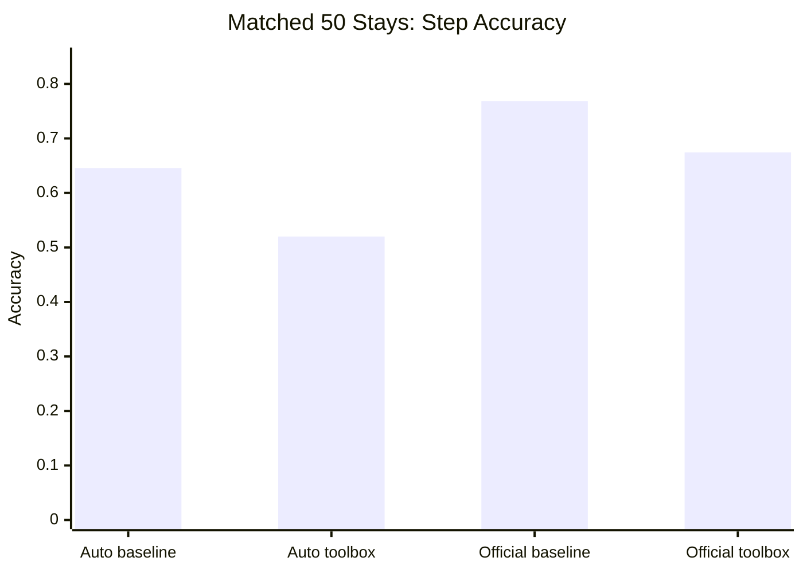
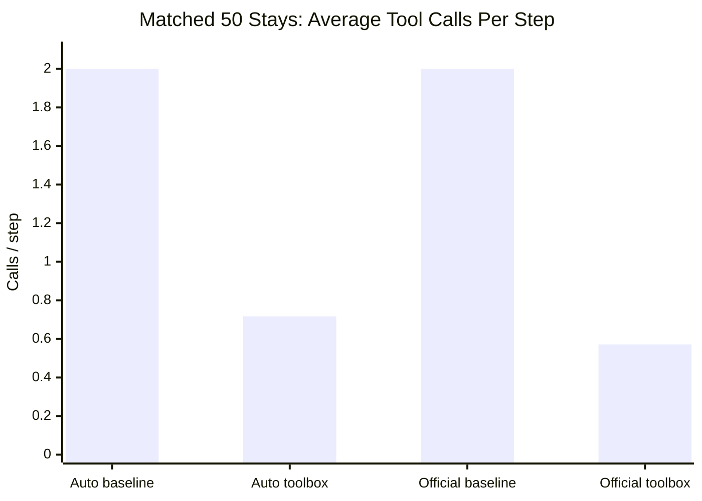
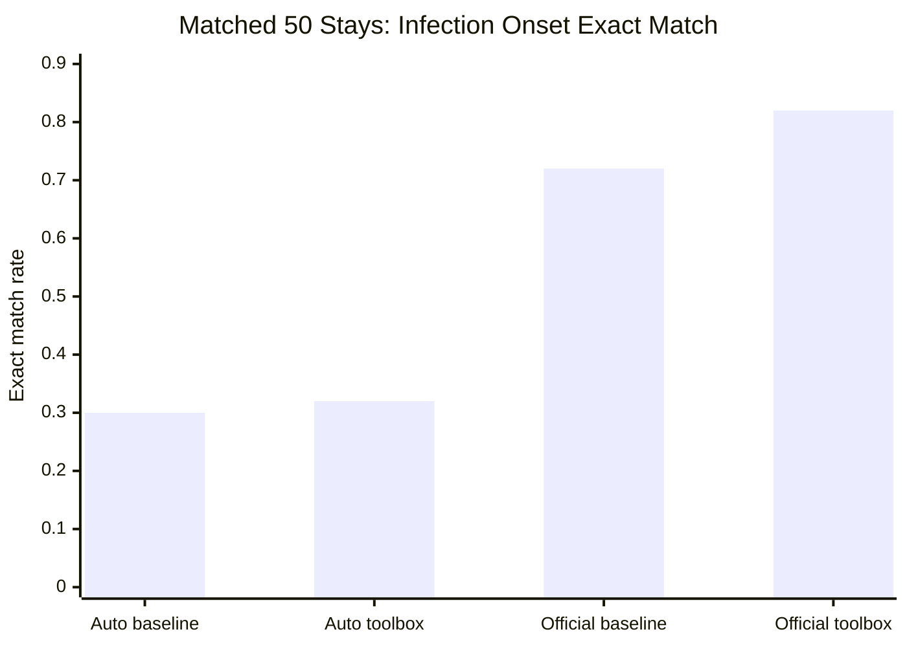
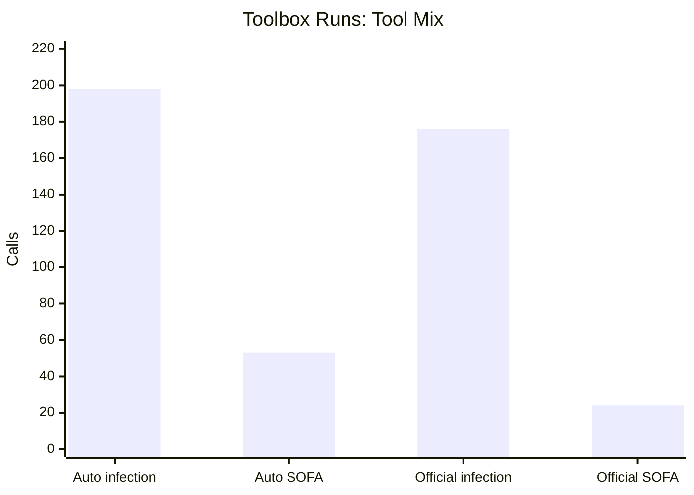

# Single-Sepsis Comparison: Fixed Tool Calling vs Toolbox With History

This note compares four Qwen3-30B result folders for the **single-task sepsis** benchmark:

1. [auto_sepsis_Qwen3-30B-A3B-Instruct-2507](/Users/chloe/Documents/New project/result/auto_sepsis_Qwen3-30B-A3B-Instruct-2507)
2. [official_single_sepsis_Qwen3-30B-A3B-Instruct-2507](/Users/chloe/Documents/New project/result/official_single_sepsis_Qwen3-30B-A3B-Instruct-2507)
3. [sepsis_toolbox_history_autoformalized_qwen3_30b](/Users/chloe/Documents/New project/result/sepsis_toolbox_history_autoformalized_qwen3_30b)
4. [sepsis_toolbox_history_official_qwen3_30b](/Users/chloe/Documents/New project/result/sepsis_toolbox_history_official_qwen3_30b)

## Main Takeaways

- The old single-sepsis baseline is **not a real longitudinal task** in practice.
  Every step always calls both `query_suspicion_of_infection` and `query_sofa`, so tool use is fixed and history reuse is irrelevant.
- The new toolbox-with-history protocol **is a real longitudinal task**.
  Tool use becomes sparse, selective, and history-sensitive:
  - many steps have no new tool call
  - repeated-call rate becomes measurable
  - necessary-call coverage becomes meaningful
  - marginal utility of a tool call becomes measurable
- On the matched 50-stay cohort, **official toolbox-with-history** is the strongest longitudinal variant.
  It uses far fewer tools than the old official baseline, improves infection onset timing substantially, and keeps evidence discipline clean.
- The cost of realism is real:
  toolbox-with-history is more efficient, but step accuracy is lower than the fixed-tool baseline.
- Across both protocols, **official > autoformalized**.

## Source Of Truth And Caveats

- The old baseline folders contain **98 trajectories**.
- The toolbox-with-history folders contain **50 trajectories**.
- For fair comparison, the fixed-tool baselines were also evaluated on the **matched first 50 trajectory IDs** used by the toolbox runs.
- For the official toolbox folder, [events.jsonl](/Users/chloe/Documents/New project/result/sepsis_toolbox_history_official_qwen3_30b/events.jsonl) appears stale and contains 60 trajectories, while [rollouts.json](/Users/chloe/Documents/New project/result/sepsis_toolbox_history_official_qwen3_30b/rollouts.json) and [eval.json](/Users/chloe/Documents/New project/result/sepsis_toolbox_history_official_qwen3_30b/eval.json) are internally consistent at 50 trajectories.
  This report treats `rollouts.json` and `eval.json` as the source of truth.
- For toolbox runs, the newer `toolbox_efficiency` metrics are more informative than the old `tool_grounding` metric.

## Protocol Meaning

### Old fixed-tool single sepsis

- visible tools: `query_suspicion_of_infection`, `query_sofa`
- behavior in practice: always call both tools each step
- average calls per step: exactly `2.0`
- zero-call rate: `0.0`

This is a useful benchmark baseline, but it is closer to a fixed repeated checklist than to longitudinal monitoring.

### New toolbox with history

- visible tools:
  - `query_suspicion_of_infection`
  - `query_sofa`
  - `query_kdigo_stage`
  - `query_ventilation_status`
- behavior in practice:
  - variable number of calls per step
  - many steps with no new tool call
  - explicit reuse of prior checkpoint history

This is much closer to a real longitudinal monitoring setting.

## Saved Eval Summary

These are the saved run-level evals as found in each folder.

| Run | Backend | Protocol | N trajectories | Step acc | Macro F1 | Infection exact | Alert exact |
| --- | --- | --- | ---: | ---: | ---: | ---: | ---: |
| Auto baseline | autoformalized | fixed single sepsis | 98 | 0.6589 | 0.5463 | 0.2959 | 0.5612 |
| Official baseline | official | fixed single sepsis | 98 | 0.8003 | 0.6152 | 0.6875 | 0.3958 |
| Auto toolbox | autoformalized | rolling_toolbox_with_history | 50 | 0.5200 | 0.4589 | 0.3800 | 0.4800 |
| Official toolbox | official | rolling_toolbox_with_history | 50 | 0.6743 | 0.6188 | 0.7200 | 0.6000 |

Interpretation:

- On their native saved evals, the official toolbox run already looks competitive on alert timing and clearly better than the auto toolbox run.
- But because the sample sizes differ, the fairest head-to-head comparison is the matched 50-stay slice below.

## Matched 50-Stay Comparison

This uses the 50 trajectory IDs from the toolbox runs and compares all four conditions on the same cohort.

### Step-Level And Tool-Use Summary

| Run | Step acc | Avg tool calls/step | Zero-call rate | Tool counts |
| --- | ---: | ---: | ---: | --- |
| Auto baseline | 0.6457 | 2.0000 | 0.0000 | infection `350`, sofa `350` |
| Official baseline | 0.7686 | 2.0000 | 0.0000 | infection `350`, sofa `350` |
| Auto toolbox | 0.5200 | 0.7171 | 0.2829 | infection `198`, sofa `53` |
| Official toolbox | 0.6743 | 0.5714 | 0.4286 | infection `176`, sofa `24` |

What this means:

- The fixed baselines are rigid:
  - exactly 2 calls per step
  - no history reuse
  - no tool-efficiency tradeoff
- The toolbox runs are genuinely longitudinal:
  - auto toolbox reduces calls by `64.1%` vs auto baseline
  - official toolbox reduces calls by `71.4%` vs official baseline
  - official toolbox makes no new tool call on `42.86%` of steps

### Transition Timing On The Matched 50-Stay Cohort

Ground-truth onset was reconstructed directly from the per-step `gt_action` sequence in `rollouts.json`.

| Run | Infection exact | Infection MAE | Infection early | Infection late | Infection missed | Alert exact | Alert MAE | Alert early | Alert late | Alert missed |
| --- | ---: | ---: | ---: | ---: | ---: | ---: | ---: | ---: | ---: | ---: |
| Auto baseline | 0.3000 | 4.88 | 0.34 | 0.36 | 0.00 | 0.6200 | 2.96 | 0.26 | 0.12 | 0.00 |
| Official baseline | 0.7200 | 2.64 | 0.16 | 0.12 | 0.00 | 0.5600 | 2.64 | 0.36 | 0.08 | 0.00 |
| Auto toolbox | 0.3200 | 4.3333 | 0.32 | 0.32 | 0.04 | 0.4800 | 4.8372 | 0.12 | 0.26 | 0.14 |
| Official toolbox | 0.8200 | 0.40 | 0.18 | 0.00 | 0.00 | 0.6000 | 1.90 | 0.08 | 0.12 | 0.20 |

Key observations:

- **Official toolbox** is the best infection-onset tracker in this comparison:
  - infection exact match improves from `0.72` to `0.82`
  - infection MAE drops from `2.64h` to `0.40h`
  - late infection calls drop from `0.12` to `0.00`
- For alert timing, **official toolbox** also improves precision:
  - alert exact match improves from `0.56` to `0.60`
  - alert MAE improves from `2.64h` to `1.90h`
  - early alert rate drops from `0.36` to `0.08`
- But official toolbox also becomes more conservative at the alert stage:
  - alert missed rate rises from `0.00` to `0.20`
  - this matches the confusion pattern where many true alerts are downgraded to `infection_suspect`
- Auto toolbox is much less stable:
  - infection timing is only slightly better than auto baseline
  - alert timing is worse than auto baseline

## Why Toolbox With History Is A Real Longitudinal Task

The strongest evidence is not just the lower call count. It is the fact that tool use becomes behaviorally meaningful.

### Fixed baseline

- every step calls both tools
- repeated-call rate is not interesting because the protocol forces repetition
- necessary-call coverage is trivially perfect because every call is forced
- marginal utility is not meaningful because the model cannot skip low-value calls

### Toolbox with history

- repeated-call rate becomes meaningful
- zero-call steps indicate actual history reuse
- necessary-call coverage shows whether the model knows when it must check something
- positive-action-without-sufficient-evidence shows whether the model is making unsupported decisions
- marginal utility of call shows whether calls add new evidence

This is the core reason the toolbox-with-history protocol is a more realistic longitudinal benchmark.

## Toolbox Efficiency: Official vs Autoformalized

These metrics only apply to the two toolbox-with-history runs.

| Metric | Auto toolbox | Official toolbox |
| --- | ---: | ---: |
| Avg tool calls / step | 0.7171 | 0.5714 |
| Steps without tool calls | 0.2829 | 0.4286 |
| Repeated tool call rate | 0.6972 | 0.6600 |
| Repeated infection call after positive | 0.0101 | 0.0000 |
| Positive action without sufficient evidence | 0.0526 | 0.0000 |
| Necessary infection-call coverage | 0.8837 | 1.0000 |
| Necessary SOFA-call coverage for alert | 1.0000 | 1.0000 |
| Marginal utility of any call | 0.4502 | 0.3900 |

Tool mix:

| Run | Infection calls | SOFA calls | SOFA share |
| --- | ---: | ---: | ---: |
| Auto toolbox | 198 | 53 | 21.1% |
| Official toolbox | 176 | 24 | 12.0% |

Per-tool marginal utility:

| Run | Infection-call utility | SOFA-call utility |
| --- | ---: | ---: |
| Auto toolbox | 0.4192 | 0.5660 |
| Official toolbox | 0.3352 | 0.7917 |

Interpretation:

- Official toolbox is more disciplined:
  - fewer calls overall
  - more zero-call steps
  - no unsupported positive actions
  - perfect necessary-call coverage on both infection and SOFA
- Official SOFA calls are much more targeted:
  - only `24` SOFA calls total
  - but `79.17%` of them are marginally useful
- Auto toolbox explores more and calls SOFA more often, but still produces more unsupported positives and weaker decision quality

## Error Pattern Comparison

### Official baseline

Main pattern on matched 50:

- strong `keep_monitoring -> keep_monitoring`
- strong `trigger_sepsis_alert -> trigger_sepsis_alert`
- but substantial hard over-alerting:
  - `keep_monitoring -> trigger_sepsis_alert`: `39`

This looks like a powerful but blunt fixed-checklist policy.

### Official toolbox

Main pattern on matched 50:

- `keep_monitoring -> keep_monitoring`: `145`
- `trigger_sepsis_alert -> trigger_sepsis_alert`: `56`
- `trigger_sepsis_alert -> infection_suspect`: `56`
- `keep_monitoring -> trigger_sepsis_alert`: `19`

So the toolbox policy reduces hard false alerts, but often stops one level short of the final alert.

### Auto baseline

Main pattern on matched 50:

- `keep_monitoring -> keep_monitoring`: `116`
- `trigger_sepsis_alert -> trigger_sepsis_alert`: `102`
- `keep_monitoring -> trigger_sepsis_alert`: `56`

This version over-alerts aggressively.

### Auto toolbox

Main pattern on matched 50:

- `keep_monitoring -> keep_monitoring`: `121`
- `keep_monitoring -> infection_suspect`: `67`
- `trigger_sepsis_alert -> trigger_sepsis_alert`: `47`
- `trigger_sepsis_alert -> infection_suspect`: `46`

This version shifts many errors into overcalling `infection_suspect`.

## Bottom Line

If the goal is raw step accuracy, the old **official fixed-tool baseline** is still strongest.

If the goal is a **real longitudinal benchmark with meaningful tool-use evaluation**, the most promising condition here is **official toolbox with history**:

- it uses much less tool budget
- it makes explicit history reuse possible
- it keeps evidence use disciplined
- it achieves the best infection-onset timing on the matched cohort
- it improves alert timing precision relative to the fixed official baseline

Its main remaining weakness is clear:

- it under-calls or under-escalates at the alert stage
- practically, that means too many true alerts become `infection_suspect`
- the next prompt/tooling improvement should focus on when SOFA re-checking is necessary for escalation

## Suggested Next Follow-Up

The best next analysis or patch is:

1. keep the official toolbox-with-history protocol as the main longitudinal direction
2. tighten escalation behavior for true alert transitions
3. specifically target the `trigger_sepsis_alert -> infection_suspect` error mode
4. keep using toolbox-efficiency metrics as first-class outputs, not just step accuracy

## Future Direction: What To Improve Next

The comparison suggests that the new toolbox-with-history protocol is already the right **benchmark direction**, but the next gains will come from better **task design** and a better **agent framework**.

### Task Design

#### 1. Keep the toolbox-with-history protocol as the main longitudinal benchmark

The benchmark should not move back toward fixed stepwise calling. The old protocol is useful as a baseline, but it does not really test longitudinal monitoring because tool use is predetermined.

The benchmark should keep:

- variable tool use
- explicit prior-step history
- zero-call steps as a valid outcome
- tool-use efficiency as a first-class metric

#### 2. Add explicit latent-state evaluation

The current action space is simple, but the alert-stage error pattern suggests that the benchmark would benefit from tracking latent state explicitly:

- infection established?
- alert-level organ dysfunction established?
- last confirmed SOFA threshold time?

This could remain an internal eval target rather than a visible action label. It would let us distinguish:

- bad longitudinal state tracking
- from bad final action choice

#### 3. Split reporting into infection-tracking and escalation-tracking phases

The results suggest that these are two different subproblems:

- infection tracking
- escalation after infection is already known

Future benchmark reporting should therefore include:

- infection-onset timing
- post-infection escalation timing
- SOFA re-check coverage after infection is established
- escalation delay after the first alert-eligible checkpoint

That would make the current “stops at `infection_suspect`” problem easier to localize.

#### 4. Add a richer derived history state

The flat rolling history is transparent, but still cognitively heavy for the agent.

Keep the full history, but also provide a compact derived state summary, for example:

- infection state
- sofa state
- last infection check step
- last sofa check step
- whether each concept is resolved or still open

This would preserve the longitudinal task while making the agent’s decision problem cleaner.

### Agent Framework

#### 5. Move from a flat prompt policy to a structured controller

The current toolbox controller is still mostly “tool-or-act” from a single prompt. The next version should maintain an explicit belief state.

Suggested controller loop:

1. update belief state from rolling history and current tool outputs
2. identify unresolved or stale evidence gaps
3. choose the next tool only if it closes a meaningful gap
4. emit the final action only when the relevant state is established

Useful internal fields:

- infection status
- sofa status
- last confirmed infection evidence
- last confirmed sofa evidence
- whether evidence is stale at the current checkpoint

#### 6. Add an explicit escalation gate

The dominant toolbox weakness is that many true alerts become `infection_suspect`.

The controller should therefore enforce a lightweight escalation rule:

- `trigger_sepsis_alert` requires explicit infection evidence plus explicit alert-level SOFA evidence
- if infection is already known but SOFA evidence is unresolved, the controller should prefer `query_sofa` over finalizing at `infection_suspect`

This could be implemented:

- first as a stronger prompt rule
- then more robustly as a controller-side guardrail

#### 7. Add a verifier pass for positive decisions

A practical next step is a cheap verifier only for positive outputs.

Verifier questions:

- Is infection explicitly established?
- If `trigger_sepsis_alert` is proposed, is alert-level SOFA evidence explicitly established?
- If not, what is the highest-value missing tool?

This should improve reliability without turning every step into a multi-pass pipeline.

#### 8. Use retrieval over history, not only full history

The agent should continue to see full rolling history for transparency, but it would likely benefit from retrieval-style access to the most relevant prior evidence:

- latest infection-positive event
- latest SOFA summary
- maximum SOFA so far
- last step each concept was checked

That should make history reuse more reliable and reduce unnecessary rereading of the full history list.

### Measurement And Pipeline

#### 9. Expand tool-use evaluation

The current toolbox metrics are already much better than the old setup, but the next round should add:

- phase-conditioned marginal utility
- staleness-aware necessary-call coverage
- escalation-opportunity capture
- correctness on zero-call steps

These would better distinguish genuinely informed history reuse from simply skipping tools.

#### 10. Tighten artifact hygiene

The comparison also surfaced a practical issue:

- stale `events.jsonl` can diverge from `rollouts.json`

Future runs should:

- treat `rollouts.json` as canonical
- store a run manifest with:
  - dataset hash
  - trajectory IDs
  - protocol version
  - metric version
- optionally export matched-cohort subsets directly

### Recommended Roadmap

The best roadmap from here is:

1. keep `rolling_toolbox_with_history` as the main longitudinal protocol
2. add a compact derived state summary on top of rolling history
3. implement a controller-side escalation gate
4. add a verifier pass for positive decisions
5. expand phase-conditioned tool-use metrics
6. rerun official toolbox before expanding the visible tool set further

## Final Recommendation

The main lesson is:

- the benchmark form is already strong
- the next improvements should be concentrated on the agent framework

So the future direction should be:

- preserve the real longitudinal task
- make the controller more state-aware
- make escalation more explicitly evidence-gated
- keep tool-use and history-use evaluation as central benchmark outputs
