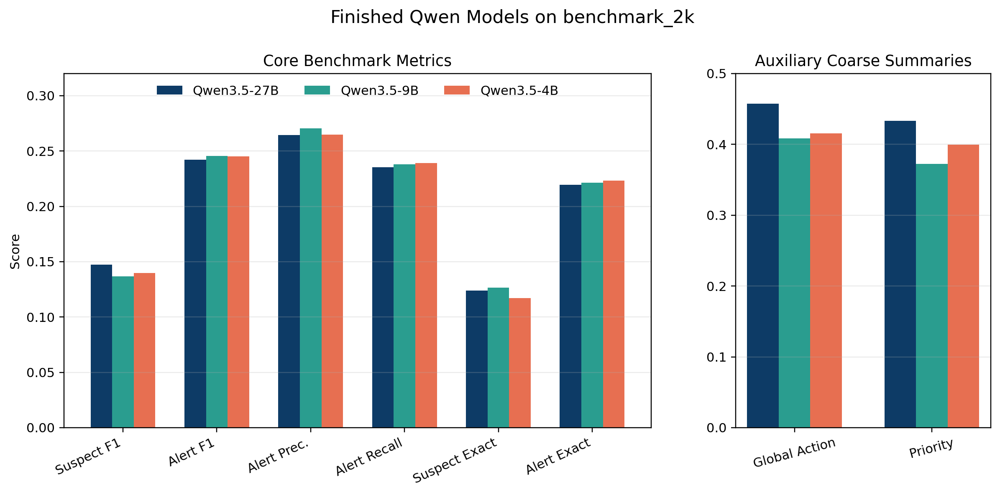
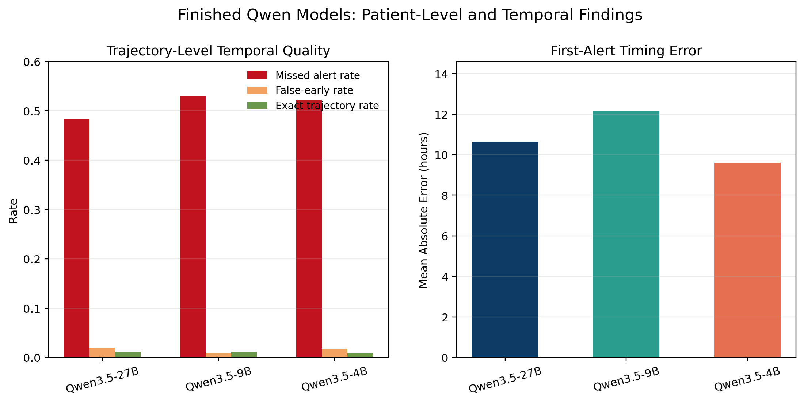
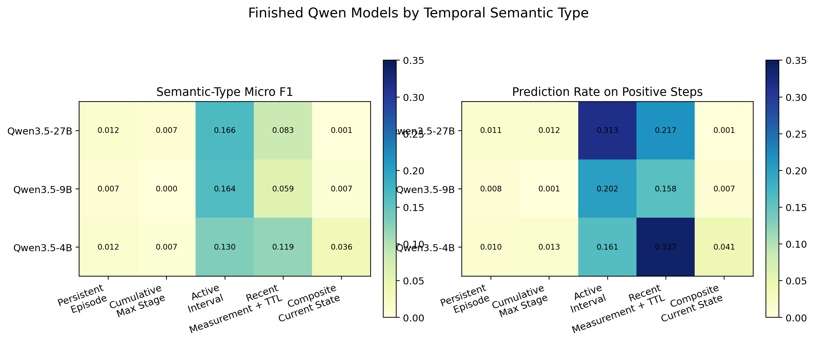

# Paper-Style Results Section for Rolling Surveillance Benchmark

Date: 2026-05-07

## Intended Use

This document is a tighter, paper-style rewrite of the rolling surveillance results.

It prioritizes:

- core structured-state metrics
- patient-level temporal quality
- temporal-semantic analysis

It treats:

- `global_action_accuracy`
- `priority_accuracy`

as auxiliary coarse response-layer summaries rather than the main benchmark evidence.

Reference artifact:

- [rolling_eval_autoform_final_report_2026-05-06.md](/Users/chloe/Documents/New%20project/docs/surveilance/rolling_eval_autoform_final_report_2026-05-06.md)

## Suggested Results Section

### Main Text Draft

We evaluate rolling ICU surveillance on the primary `48h` benchmark release containing `2,000` held-out stays and `26,000` checkpoint decisions. Because the benchmark output is a structured surveillance state, we prioritize family-level recovery metrics over compressed response-layer summaries. The main benchmark metrics are `suspected_conditions_macro_f1`, `alerts_macro_f1`, `alerts_macro_precision`, `alerts_macro_recall`, and exact set match on `suspected_conditions` and `alerts`. We additionally report patient-level temporal metrics through first-alert timing error, false-early alert counts, missed-alert trajectories, and a strict longitudinal exact-match rate over the full stay.

Among the fully completed open-weight runs, `Qwen3.5-27B` is the strongest overall model on the primary benchmark. It achieves the best completed-run `suspected_conditions_macro_f1` (`0.1472`) and misses fewer alerting trajectories (`909`) than the smaller completed Qwen variants. However, all completed Qwen models remain far from reliable structured longitudinal surveillance: `alerts_macro_f1` remains only `0.2423` to `0.2456`, exact set match on `alerts` remains only `0.2195` to `0.2232`, and strict patient-level exactness is approximately `1%`. These results indicate that moderate checkpoint-level plausibility does not translate into robust recovery of the full evolving disease-family state.

The strongest provisional run is `gpt-oss-120b`, which completed `1,026/2,000` trajectories before interruption. On the completed subset it exceeds the finished Qwen runs on several core and temporal metrics, including `suspected_conditions_macro_f1` (`0.2054`), `alerts_macro_f1` (`0.2533`), and first-alert timing error (`6.85h`), while missing substantially fewer alerting trajectories (`209`). However, because the run is incomplete, it should be treated as suggestive rather than definitive. In the current artifact set, the most reliable completed evidence therefore comes from the Qwen family.

The suspect and alert metrics also need to be decomposed by checkpoint type. On the primary `benchmark_2k` release, the gold suspect set is empty on `12.81%` of checkpoints and the gold alert set is empty on `22.64%` of checkpoints. Because the benchmark scorer gives perfect set precision, recall, and F1 to empty-empty matches, overall exact-match metrics partly reflect negative-set correctness. We therefore recommend reporting the structured-state tables in three slices: overall checkpoints, negative-set checkpoints, and positive-set checkpoints. This decomposition makes clear that the apparent clustering of `alerts_exact_match` near `0.22` is mostly an empty-alert baseline effect rather than evidence that the Qwen models are equally good at positive alert recovery.

The temporal-semantic breakdown shows why the benchmark is difficult. The finished Qwen models are strongest on `active_interval` states such as ongoing respiratory support, vasoactive support, and CRRT. They are weaker on `recent_measurement + TTL` states, and they are weakest by far on `persistent_episode`, `cumulative_max_stage`, and `composite_current_state` semantics. In particular, they almost never sustain persistent infection or sepsis state once it becomes active, rarely preserve cumulative AKI stage across checkpoints, and almost never reconstruct composite shock states. This pattern suggests that the main challenge is not local retrieval alone, but longitudinal state maintenance and recomputation under heterogeneous temporal rules.

### Suggested Shorter Version

On the primary `2,000`-stay rolling surveillance benchmark, the strongest fully completed model is `Qwen3.5-27B`, but all completed models remain weak on the benchmark’s core structured-state outputs. Family-level `alerts_macro_f1` remains near `0.24`, exact set recovery remains low, missed-alert trajectories remain common, and strict patient-level exactness is near zero. The finished Qwen models are strongest on active support states and weakest on persistent, cumulative, and composite semantics, indicating that the main challenge is longitudinal state maintenance rather than isolated local prediction. A partial `gpt-oss-120b` run suggests that stronger structured-state and temporal performance may be achievable, but it is incomplete and should be treated as provisional.

## Main Table

### Table 1 Caption

Table 1. Core structured-state and patient-level temporal performance on the primary `benchmark_2k` rolling surveillance benchmark. The main benchmark metrics evaluate recovery of the checkpoint-level disease-family state through `suspected_conditions` and `alerts`, while the temporal metrics evaluate whether alerts are emitted at the correct stay-level time. `strict_all4_trajectory_rate` is a derived longitudinal exactness metric requiring exact agreement on `global_action`, `priority`, `suspected_conditions`, and `alerts` at every checkpoint of the stay.

### Table 1

| Model | Completed stays | `suspected_conditions_macro_f1` | `alerts_macro_f1` | `alerts_macro_precision` | `alerts_macro_recall` | `suspected_conditions_exact_match` | `alerts_exact_match` | `first_alert_mean_abs_error_hours` | `false_early_alert_trajectories` | `missed_alert_trajectories` | `strict_all4_trajectory_rate` |
|---|---:|---:|---:|---:|---:|---:|---:|---:|---:|---:|---:|
| `Qwen3.5-27B` | `2000/2000` | `0.1472` | `0.2423` | `0.2643` | `0.2355` | `0.1239` | `0.2195` | `10.6119` | `37` | `909` | `0.0110` |
| `Qwen3.5-4B` | `2000/2000` | `0.1396` | `0.2453` | `0.2647` | `0.2390` | `0.1171` | `0.2232` | `9.5982` | `34` | `982` | `0.0090` |
| `Qwen3.5-9B` | `2000/2000` | `0.1366` | `0.2456` | `0.2707` | `0.2380` | `0.1266` | `0.2213` | `12.1627` | `17` | `998` | `0.0115` |
| `gpt-oss-120b` | `1026/2000` | `0.2054` | `0.2533` | `0.2759` | `0.2476` | `0.1276` | `0.2123` | `6.8496` | `58` | `209` | `0.0049` |
| `gemma-4-31B-it` | `1714/2000` | `0.1344` | `0.2277` | `0.2304` | `0.2269` | `0.1309` | `0.2253` | `22.9554` | `2` | `1455` | `0.0117` |

## Structured-State Decomposition Tables

All decomposition values below were recomputed directly from `benchmark_2k` `rollouts.json` using the same `_set_f1` scorer implemented in [environment.py](/Users/chloe/Documents/New%20project/src/sepsis_mvp/environment.py:422), so they are numerically consistent with the official `evaluation.json` metrics.

### Table 2 Caption

Table 2. Overall suspect- and alert-set performance for the finished Qwen models on `benchmark_2k`. This table uses the official benchmark scorer on all checkpoints and corresponds directly to the structured-state columns in Table 1.

### Table 2

| Model | `suspect_overall_exact` | `suspect_overall_macro_f1` | `alert_overall_exact` | `alert_overall_macro_f1` | `alert_overall_macro_precision` | `alert_overall_macro_recall` |
|---|---:|---:|---:|---:|---:|---:|
| `Qwen3.5-27B` | `0.1239` | `0.1472` | `0.2195` | `0.2423` | `0.2643` | `0.2355` |
| `Qwen3.5-9B` | `0.1266` | `0.1366` | `0.2213` | `0.2456` | `0.2707` | `0.2380` |
| `Qwen3.5-4B` | `0.1171` | `0.1396` | `0.2232` | `0.2453` | `0.2647` | `0.2390` |

### Table 3 Caption

Table 3. Negative-set checkpoints only for the finished Qwen models on `benchmark_2k`. Because empty-empty matches receive precision `= 1`, recall `= 1`, and F1 `= 1` under the benchmark scorer, negative-only exactness is effectively a measure of how consistently the model preserves the empty set when no suspect or alert family is active.

### Table 3

| Model | `suspect_negative_exact` | `suspect_negative_pred_empty_rate` | `alert_negative_exact` | `alert_negative_pred_empty_rate` |
|---|---:|---:|---:|---:|
| `Qwen3.5-27B` | `0.9189` | `0.9189` | `0.9529` | `0.9529` |
| `Qwen3.5-9B` | `0.9601` | `0.9601` | `0.9647` | `0.9647` |
| `Qwen3.5-4B` | `0.8766` | `0.8766` | `0.9477` | `0.9477` |

### Table 4 Caption

Table 4. Positive-set checkpoints only for the finished Qwen models on `benchmark_2k`. This slice exposes the true structured-state difficulty: once any suspect or alert family is active, exact match becomes near zero and set-level recovery remains poor for all completed Qwen models.

### Table 4

| Model | `suspect_positive_exact` | `suspect_positive_pred_nonempty_rate` | `suspect_positive_macro_f1` | `alert_positive_exact` | `alert_positive_pred_nonempty_rate` | `alert_positive_macro_f1` | `alert_positive_macro_precision` | `alert_positive_macro_recall` |
|---|---:|---:|---:|---:|---:|---:|---:|---:|
| `Qwen3.5-27B` | `0.0071` | `0.1657` | `0.0338` | `0.0049` | `0.3124` | `0.0343` | `0.0628` | `0.0255` |
| `Qwen3.5-9B` | `0.0041` | `0.0758` | `0.0156` | `0.0038` | `0.2449` | `0.0352` | `0.0676` | `0.0253` |
| `Qwen3.5-4B` | `0.0055` | `0.2112` | `0.0313` | `0.0112` | `0.2626` | `0.0398` | `0.0648` | `0.0317` |

## Auxiliary Table

### Table 5 Caption

Table 5. Auxiliary coarse response-layer summary metrics on the primary `benchmark_2k` benchmark. These metrics evaluate the compressed checkpoint output fields `global_action` and `priority`, which are derived from the richer structured checkpoint state rather than representing the full clinical target space.

### Table 5

| Model | Completed stays | `global_action_accuracy` | `priority_accuracy` |
|---|---:|---:|---:|
| `Qwen3.5-27B` | `2000/2000` | `0.4577` | `0.4332` |
| `Qwen3.5-4B` | `2000/2000` | `0.4153` | `0.3993` |
| `Qwen3.5-9B` | `2000/2000` | `0.4083` | `0.3726` |
| `gpt-oss-120b` | `1026/2000` | `0.6317` | `0.5206` |
| `gemma-4-31B-it` | `1714/2000` | `0.2674` | `0.2409` |

## Qwen Figures

### Figure 1

Figure 1. Finished Qwen models on the primary `benchmark_2k` benchmark. Left: core structured-state metrics. Right: auxiliary coarse response-layer summary metrics. The main pattern is that coarse summary performance is consistently higher than structured family-state recovery, showing that simplified action/priority labels overstate apparent model capability.

### Figure 2

Figure 2. Patient-level temporal quality for the finished Qwen models. Left: missed-alert rate, false-early alert rate, and strict exact trajectory rate. Right: first-alert mean absolute timing error. The dominant failure mode is missing true alerting trajectories rather than over-alerting, while strict longitudinal exactness remains near zero for all three models.

### Figure 3

Figure 3. Temporal-semantic analysis for the finished Qwen models. Left: semantic-type micro F1. Right: prediction rate on positive checkpoints for each semantic type. The models perform best on `active_interval` states, less well on `recent_measurement + TTL`, and extremely poorly on `persistent_episode`, `cumulative_max_stage`, and `composite_current_state`, indicating weak longitudinal carry-forward and recomposition behavior.

## Suggested Figure Callouts in Main Text

- “Figure 1 shows that the apparent gap between coarse and core metrics is substantial: the models are much better at compressed response-layer summaries than at recovering the underlying disease-family state.”
- “Figure 2 shows that the main patient-level error mode is not mild timing jitter but wholesale failure to surface true alerting trajectories.”
- “Figure 3 isolates the central benchmark difficulty: the models can partially detect locally current support states, but they rarely maintain persistent state, preserve cumulative state, or recompute composite state correctly.”

## Suggested Table Callouts in Main Text

- “Table 1 should be treated as the main benchmark table because it evaluates the structured state directly and includes patient-level temporal quality.”
- “Tables 2 to 4 explain why the overall suspect and alert metrics look deceptively close: negative-set checkpoints are easy, but positive-set recovery remains extremely weak.”
- “Table 5 is intentionally auxiliary: `global_action` and `priority` are compressed response-layer summaries rather than the full clinical target.”

## Notes for Final Paper Framing

- Lead with `benchmark_2k`, not `benchmark_100`.
- Use the finished Qwen runs as the clean completed comparison.
- Treat `gpt-oss-120b` as the strongest provisional model, but keep its incompleteness explicit.
- Treat Claude and Gemini only as incomplete pilot evidence unless rerun to completion.
- In the main text, avoid describing `global_action_accuracy` as the benchmark’s primary score.
- In the main text, explain that `alerts_exact_match` around `0.22` is largely a negative-set baseline effect and should be read alongside the positive-only tables.
- Emphasize that the benchmark is challenging because it requires recovery of a structured evolving state under mixed temporal semantics, not merely a locally plausible escalation/no-escalation decision.
