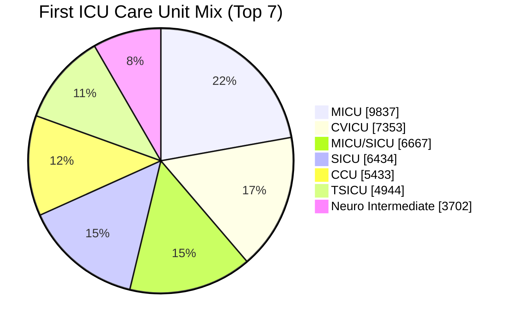
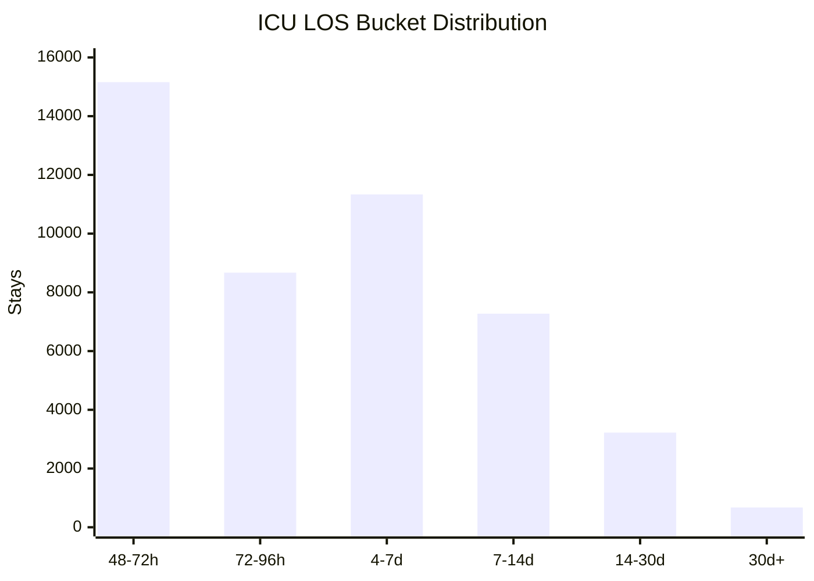
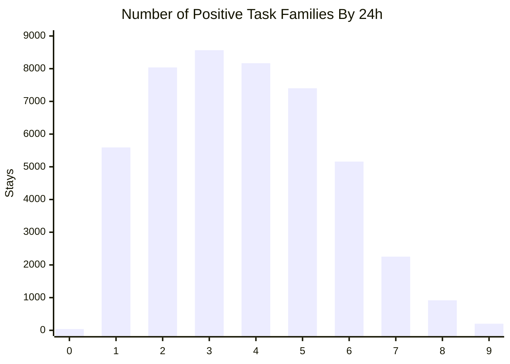

# Phase-1 Autoformalized Surveillance Dataset Report

Date: 2026-04-23

## Design Update

This report should now be read together with the revised surveillance benchmark design:

- [general_icu_surveillance_dataset_design_2026-04-25.md](/Users/chloe/Documents/New project/docs/surveilance/general_icu_surveillance_dataset_design_2026-04-25.md)

Important update:

- this phase-1 report remains the cohort and source-feasibility foundation
- but it no longer defines the final benchmark task space or ground-truth philosophy by itself
- the finalized cohort decision and official derived-SQL cohort audit are now documented in:
  - [surveillance_dataset_cohort_audit_2026-04-25.md](/Users/chloe/Documents/New project/docs/surveilance/surveillance_dataset_cohort_audit_2026-04-25.md)

The revised benchmark contract is:

- MIMIC-derived SQL ground truth
- search-based discovery of guidelines and autoformalized functions
- compressed rolling memory
- larger multi-label ICU decision space

## Scope

This report covers the first dataset-curation phase for the general ICU surveillance benchmark.

The goal of this phase is not to finalize checkpoint labels yet. The goal is to build the reusable dataset foundation:

- the eligible ICU cohort
- the deterministic split assignment
- the every-4-hour checkpoint grid
- the finalized task registry
- the raw source-coverage analysis tied to the autoformalized function library

Artifacts are stored under:

- [dataset/surveilance](/Users/chloe/Documents/New project/dataset/surveilance)

This phase originally followed the earlier autoformalized-first design notes in:

- [autoformalized_general_icu_monitoring_benchmark_design_2026-04-23.md](/Users/chloe/Documents/New project/docs/autoformalized_general_icu_monitoring_benchmark_design_2026-04-23.md)
- [autoformalized_dataset_curation_task_audit_2026-04-23.md](/Users/chloe/Documents/New project/docs/autoformalized_dataset_curation_task_audit_2026-04-23.md)

## Package Contents

The dataset package now includes:

- `surveillance_stay_manifest.csv`
- `surveillance_checkpoint_grid.csv`
- `cohort_summary.csv`
- `task_source_coverage_summary.csv`
- `careunit_distribution.csv`
- `los_bucket_distribution.csv`
- `task_overlap_coverage.csv`
- `task_overlap_top_patterns.csv`
- `task_registry.csv`
- the SQL specs used to export them

Concrete artifact paths:

- [surveillance_stay_manifest.csv](/Users/chloe/Documents/New project/dataset/surveilance/surveillance_stay_manifest.csv)
- [surveillance_checkpoint_grid.csv](/Users/chloe/Documents/New project/dataset/surveilance/surveillance_checkpoint_grid.csv)
- [cohort_summary.csv](/Users/chloe/Documents/New project/dataset/surveilance/cohort_summary.csv)
- [task_source_coverage_summary.csv](/Users/chloe/Documents/New project/dataset/surveilance/task_source_coverage_summary.csv)
- [careunit_distribution.csv](/Users/chloe/Documents/New project/dataset/surveilance/careunit_distribution.csv)
- [los_bucket_distribution.csv](/Users/chloe/Documents/New project/dataset/surveilance/los_bucket_distribution.csv)
- [task_overlap_coverage.csv](/Users/chloe/Documents/New project/dataset/surveilance/task_overlap_coverage.csv)
- [task_overlap_top_patterns.csv](/Users/chloe/Documents/New project/dataset/surveilance/task_overlap_top_patterns.csv)
- [task_registry.csv](/Users/chloe/Documents/New project/dataset/surveilance/task_registry.csv)

## What This Phase Establishes

This phase locks three important decisions:

1. the benchmark cohort uses ICU stays with `LOS >= 48h`
2. the checkpoint grid is every `4` hours from `0` to `48`
3. the cohort and overlap analysis are strong enough to support a larger surveillance decision space in the revised design

## Important Interpretation

The source-coverage summary is not the final gold-label table.

Instead, in the revised benchmark design, it answers:

- do the raw source families used by the autoformalized functions appear often enough in the cohort?
- which ICU surveillance situations are likely to be easier or harder for discovery-based agents?
- how broad is the cohort support if we later expand to a larger decision catalog?

The most important consequence is now:

- the cohort remains a good foundation
- but final labels should come from MIMIC-derived SQL decision builders, not from autoformalized outputs

So this report is best interpreted as:

- cohort coverage proof
- source-feasibility proof
- overlap analysis for surveillance realism

not as the final task-definition document.

## Cohort Results

The exported cohort uses the intended `LOS >= 48h` ICU-stay rule and matches the earlier feasibility work.

Headline numbers from [cohort_summary.csv](/Users/chloe/Documents/New project/dataset/surveilance/cohort_summary.csv):

- eligible ICU stays: `46,337`
- checkpoint rows at `0, 4, ..., 48`: `602,381`
- split counts:
  - train: `32,654` stays / `424,502` checkpoint rows
  - dev: `6,934` stays / `90,142` checkpoint rows
  - test: `6,749` stays / `87,737` checkpoint rows

Length distribution:

- minimum ICU LOS in cohort: `48.0` hours
- mean ICU LOS: `149.22` hours
- median ICU LOS: `94.02` hours
- maximum ICU LOS: `5433.67` hours

These numbers confirm that the surveillance cohort is large enough for:

- a full-scale multitask rolling benchmark
- subject-level train/dev/test splits
- later rebalancing by task prevalence and onset profile

## Why This Cohort Covers Most ICU Situations

The claim is not that these tasks cover every ICU diagnosis.

The stronger and more defensible claim is:

- this task family covers most ICU *monitoring situations* that drive surveillance behavior in the first 24 to 48 hours

Those situations fall into a few broad families:

- infection and sepsis risk
- renal dysfunction and low urine output
- respiratory support escalation
- hemodynamic support escalation
- neurologic deterioration
- metabolic and acid-base derangement
- coagulation abnormality

That is a strong surveillance basis because it spans the major organ-support and deterioration axes that show up across:

- medical ICU
- cardiac ICU
- mixed med-surg ICU
- surgical ICU
- trauma ICU
- neuro-facing units

## ICU Unit Mix

The unit distribution is in:

- [careunit_distribution.csv](/Users/chloe/Documents/New project/dataset/surveilance/careunit_distribution.csv)

Top first-careunit counts:

- MICU: `9,837` (`21.23%`)
- CVICU: `7,353` (`15.87%`)
- MICU/SICU: `6,667` (`14.39%`)
- SICU: `6,434` (`13.89%`)
- CCU: `5,433` (`11.72%`)
- TSICU: `4,944` (`10.67%`)
- Neuro Intermediate: `3,702` (`7.99%`)

Together, the first six major units account for `87.77%` of the cohort. If we include `Neuro Intermediate`, coverage rises to `95.76%`.

This matters because it shows the cohort is not dominated by a single ICU type. The benchmark foundation already spans:

- medical critical illness
- post-cardiac and cardiovascular ICU care
- surgical and trauma ICU care
- neuro-intermediate and neuro-ICU pathways

### Visual: ICU Unit Mix

## ICU LOS Distribution

The LOS bucket distribution is in:

- [los_bucket_distribution.csv](/Users/chloe/Documents/New project/dataset/surveilance/los_bucket_distribution.csv)

Breakdown:

- `48-72h`: `15,159` stays (`32.71%`)
- `72-96h`: `8,671` stays (`18.71%`)
- `4-7d`: `11,336` stays (`24.46%`)
- `7-14d`: `7,274` stays (`15.70%`)
- `14-30d`: `3,224` stays (`6.96%`)
- `30d+`: `673` stays (`1.45%`)

Interpretation:

- about half the cohort is in the `48-96h` range, which is ideal for early ICU surveillance
- a large middle slice remains in the `4-14d` range, which gives us real progression and delayed-worsening cases
- there is still a meaningful long-tail of prolonged critical illness

### Visual: ICU LOS Distribution

## Task Coverage Results

The raw task coverage summary is in:

- [task_source_coverage_summary.csv](/Users/chloe/Documents/New project/dataset/surveilance/task_source_coverage_summary.csv)

This table uses the raw source families and item patterns from the autoformalized functions, not the official derived tables.

In the revised benchmark design, that is still valuable because:

- it tells us what the search-and-load agent is likely able to observe
- it helps explain success and failure modes later
- it does not constrain the official ground-truth decision space

### Headline findings by 24 hours

Strong source coverage:

- `infection`: `35,003` stays with infection-source evidence by 24h, `29,712` positive-proxy stays
- `respiratory_support`: `39,855` stays with source evidence by 24h, `25,342` positive-proxy stays
- `vasoactive_support`: `16,644` positive-proxy stays by 24h
- `neurologic_deterioration`: `46,250` stays with GCS source evidence by 24h, `20,233` severe-impairment proxy stays
- `hyperlactatemia`: `33,751` stays with blood-gas source evidence by 24h, `5,634` lactate `>= 4` proxy stays
- `severe_acidemia`: `33,751` stays with blood-gas source evidence by 24h, `3,855` pH `<= 7.20` proxy stays
- `coagulopathy`: `40,362` stays with coagulation source evidence by 24h, `6,245` INR `>= 2` proxy stays

Important support-only heads for now:

- `aki`: `46,281` stays with AKI source evidence by 24h
- `oliguria`: `18,994` stays with both urine-output and weight source evidence by 24h

Optional reserve head:

- `crrt`: `885` observed stays by 24h

### Interpretation

These numbers support three conclusions.

First:

- the cohort supports a broad surveillance task family even before the final decision registry is expanded

Second:

- the threshold-style tasks are likely to be the easiest discovery targets for the raw agent because their source signatures are relatively clean

Those strongest threshold-style heads are:

- `respiratory_support`
- `vasoactive_support`
- `neurologic_deterioration`
- `hyperlactatemia`
- `severe_acidemia`
- `coagulopathy`

Third:

- `aki`, `oliguria`, `sepsis`, and future richer decisions are exactly where we should expect a gap between derived-SQL truth and discovered autoformalized performance

That gap is now a feature of the benchmark rather than a reason to shrink the task list.

## Multitask Coverage Distribution

The strongest evidence that this benchmark covers most ICU monitoring situations is the per-stay overlap distribution in:

- [task_overlap_coverage.csv](/Users/chloe/Documents/New project/dataset/surveilance/task_overlap_coverage.csv)

This summary counts how many of the `9` directly-proxied task families are already positive by `24h`:

- `infection`
- `aki`
- `oliguria`
- `respiratory_support`
- `vasoactive_support`
- `neurologic_deterioration`
- `hyperlactatemia`
- `severe_acidemia`
- `coagulopathy`

Observed distribution:

- `0` tasks: `38` stays (`0.08%`)
- `1` task: `5,592` stays (`12.07%`)
- `2` tasks: `8,039` stays (`17.35%`)
- `3` tasks: `8,565` stays (`18.48%`)
- `4` tasks: `8,168` stays (`17.63%`)
- `5` tasks: `7,402` stays (`15.97%`)
- `6` tasks: `5,160` stays (`11.14%`)
- `7` tasks: `2,253` stays (`4.86%`)
- `8` tasks: `918` stays (`1.98%`)
- `9` tasks: `202` stays (`0.44%`)

The key cumulative facts are:

- `99.92%` of stays have at least `1` positive task family by `24h`
- `87.85%` have at least `2`
- `70.50%` have at least `3`
- `52.02%` have at least `4`
- `34.40%` have at least `5`

That is the clearest argument that this task family covers most ICU surveillance situations:

- very few eligible stays are "silent" under the task family
- most stays activate multiple organ/support/metabolic heads
- the benchmark is naturally multitask rather than artificially multitask

### Visual: Positive Task Count By 24h

## Common Overlap Patterns

The top overlap patterns among the threshold-style proxy heads are in:

- [task_overlap_top_patterns.csv](/Users/chloe/Documents/New project/dataset/surveilance/task_overlap_top_patterns.csv)

Most common patterns by 24h:

- no proxy-positive threshold head at all: `7,532` stays (`16.25%`)
- infection only: `6,377` (`13.76%`)
- infection + respiratory support + vasoactive support + neurologic deterioration: `4,665` (`10.07%`)
- infection + respiratory support + neurologic deterioration: `3,747` (`8.09%`)
- infection + respiratory support only: `2,409` (`5.20%`)
- respiratory support + neurologic deterioration without infection: `2,262` (`4.88%`)

These patterns are clinically sensible:

- there is a sizeable infection-only group
- there are many mixed support-escalation groups
- there are also non-infectious critical illness patterns with respiratory and neuro involvement

That mix is exactly what we want in a hard surveillance benchmark: not every difficult stay is "sepsis-shaped."

## What This Cohort Still Misses

Even with strong coverage, this is not everything.

Important gaps and caveats:

### 1. The benchmark is surveillance-first, not diagnosis-complete

This task family does not explicitly cover:

- arrhythmia
- acute coronary syndromes as a separate head
- stroke-specific neuro syndromes beyond GCS deterioration
- GI bleeding as a separate head
- delirium and agitation
- device complications or line infections as top-level tasks

So the correct claim is:

- broad coverage of ICU surveillance states

not:

- complete coverage of all ICU diagnoses

### 2. Measurement intensity bias

Some heads are easier to observe because the underlying measurements are almost universal:

- creatinine / AKI source
- GCS source
- coagulation source

Others depend on more selective measurement pathways:

- urine output plus usable weight for oliguria
- blood gas sampling for lactate and pH
- CRRT mode charting

This means raw observability is not equally distributed across tasks.

### 3. Source-rich does not mean label-ready

The dataset has excellent source coverage for:

- `aki`
- `sepsis`
- `oliguria`

But these are still the tasks where gold labels need extra contract logic.

Why:

- `aki` depends on the autoformalized baseline creatinine strategy
- `oliguria` depends on how we freeze duration/rate interpretation
- `sepsis` must be composed from infection plus SOFA rather than direct `sepsis3.py`

### 4. Support/intervention heads may dominate some subpopulations

The most common overlap patterns include:

- respiratory support
- vasoactive support
- neuro deterioration

That is good for ICU realism, but it may make the benchmark easier for models that learn support cues faster than slower-onset organ dysfunction logic.

We should expect this when we design later rebalancing.

### 5. Neuro head is useful but noisy

`neurologic_deterioration` is a good benchmark head because it is common and clinically relevant.

But it is not a pure neurologic phenotype:

- sedation
- intubation
- procedure context

can all affect the observed GCS pattern.

### 6. The `LOS >= 48h` filter is deliberate but selective

This cohort intentionally excludes short ICU stays.

That improves rolling-monitoring difficulty, but it also means:

- very brief ICU monitoring episodes are underrepresented
- the benchmark emphasizes sustained critical care rather than short observation stays

## What Is Ready Now

Ready now:

- the stay-level surveillance cohort
- the checkpoint grid
- the finalized task registry
- the autoformalized-source feasibility summary

Not built yet:

- the decision registry for the larger surveillance catalog
- checkpoint labels per decision
- the derived-SQL builders for alert and state decisions
- the exact scoring contract for `suspected_conditions` and `alerts`

## Recommended Next Step

The next dataset step should be:

1. define the full surveillance decision registry
2. map each decision to MIMIC-derived SQL or transparent derived extensions
3. specify which decisions belong in:
   - `suspected_conditions`
   - `alerts`
   - or both
4. then export the first labeled checkpoint dataset under this same package

## Bottom Line

This updated cohort analysis supports a stronger and more precise statement:

- the chosen task family covers most ICU *surveillance situations* in the `LOS >= 48h` cohort

That statement is supported by:

- broad unit-type coverage
- a realistic LOS distribution
- near-universal activation of at least one positive task family
- strong multitask overlap by 24 hours

The main caution is equally important:

- broad surveillance coverage does not remove the need for careful task-contract design

That is why the next phase should focus on label contracts and not just on exporting more raw tables.
