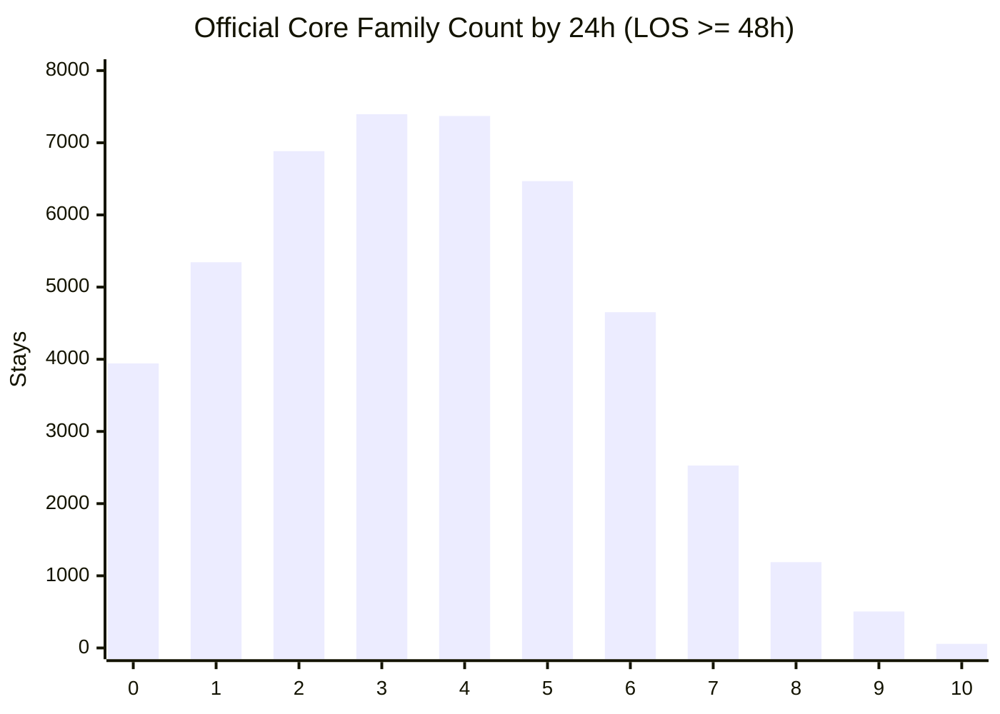
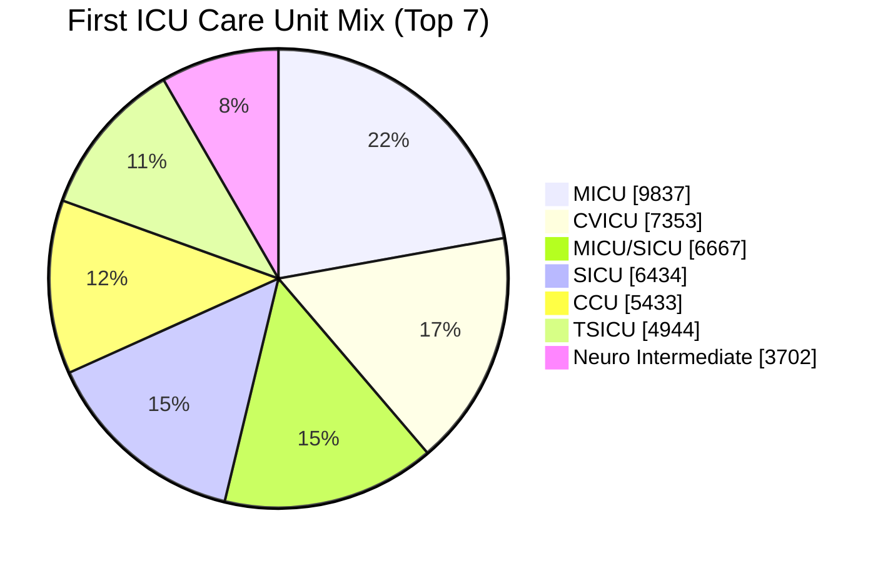
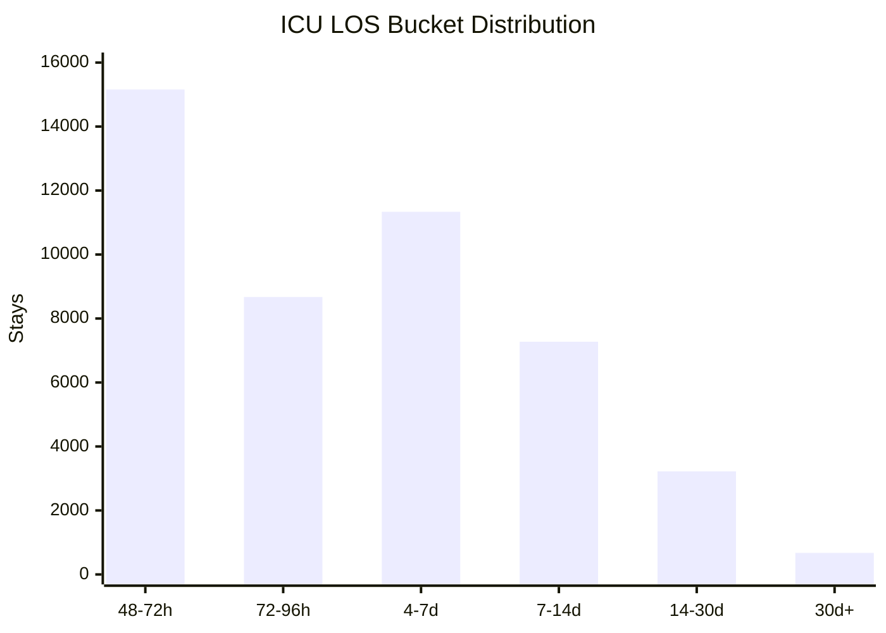
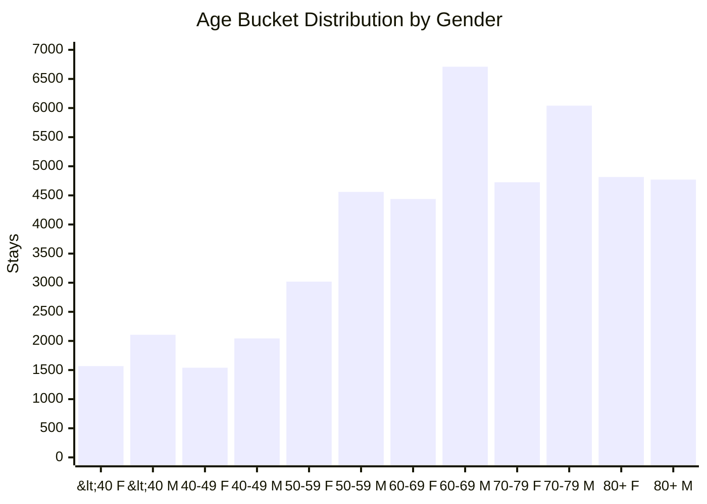

# General ICU Surveillance Cohort Audit

Date: 2026-04-25

## Purpose

This document finalizes the benchmark cohort for the general ICU surveillance dataset.

It answers four questions:

1. Which ICU-stay cohort should the benchmark use?
2. Does that cohort cover most ICU surveillance situations, rather than a narrow disease slice?
3. Is the planned decision space feasible under official MIMIC-derived SQL?
4. What problems and biases should we carry forward explicitly into checkpoint-label design?

This audit follows the revised benchmark contract in:

- [general_icu_surveillance_dataset_design_2026-04-25.md](/Users/chloe/Documents/New project/docs/surveilance/general_icu_surveillance_dataset_design_2026-04-25.md)

The key benchmark assumptions are:

- ground truth comes from official `mimiciv_derived` SQL tables plus a small number of transparent extensions
- the agent is not given a pre-curated function shortlist
- the cohort should stay broad enough to preserve real ICU heterogeneity

## Final Cohort Recommendation

Use:

- ICU stays with `LOS >= 48h`
- subject-level train/dev/test split
- checkpoint grid every `4` hours from `0` to `48`

Do not further filter the cohort by:

- blood gas availability
- coagulation availability
- guideline relevance
- autoformalized function support

The benchmark should preserve those gaps because they are part of the real agent challenge.

## Why `LOS >= 48h` Is the Best Cohort

The main cohort-comparison artifact is:

- [cohort_option_comparison.csv](/Users/chloe/Documents/New project/dataset/surveilance/cohort_option_comparison.csv)

Comparison summary:

| Cohort | Eligible stays | `% with >=1 core family by 24h` | `% with >=3 core families by 24h` | Median LOS hours |
|---|---:|---:|---:|---:|
| `LOS >= 24h` | `74,829` | `88.42%` | `57.33%` | `60.11` |
| `LOS >= 48h` | `46,337` | `91.49%` | `65.10%` | `94.02` |
| `LOS >= 72h` | `31,178` | `93.10%` | `70.07%` | `128.73` |

Interpretation:

- `LOS >= 24h` is larger, but it includes many short ICU stays with less longitudinal surveillance complexity.
- `LOS >= 72h` has the strongest task density, but it over-selects for prolonged critical illness and increases long-stay bias.
- `LOS >= 48h` is the best middle ground:
  - still large at `46,337` stays
  - dense enough that `91.49%` of stays already activate at least one core surveillance family by `24h`
  - preserves delayed worsening and multi-step trajectories without collapsing into a chronic-critical-care cohort

This is the most balanced cohort for a rolling benchmark that starts at ICU admission and runs through `48h`.

## What “Coverage” Means Here

This benchmark does not claim to cover all ICU diagnoses.

The stronger claim is:

- the cohort and decision families cover most ICU surveillance-relevant deterioration patterns in the first `24-48h`

The ten official core surveillance families used for this audit are:

1. infection
2. sepsis
3. AKI stage `2/3`
4. oliguria
5. respiratory support
6. vasoactive support
7. severe neurologic impairment
8. severe hyperlactatemia
9. severe acidemia
10. coagulopathy

These families span the major ICU monitoring axes:

- infection and organ dysfunction
- renal failure and urine-output decline
- respiratory support escalation and hypoxemia
- hemodynamic instability and shock support
- neurologic deterioration
- metabolic and acid-base failure
- hematologic/coagulation abnormality

## Coverage Strength in the Final Cohort

The official core-overlap distribution is in:

- [derived_core_overlap_distribution.csv](/Users/chloe/Documents/New project/dataset/surveilance/derived_core_overlap_distribution.csv)

By `24h` in the `LOS >= 48h` cohort:

- `91.49%` of stays have at least `1` core family active
- `79.96%` of stays have at least `2` core families active
- `65.10%` of stays have at least `3` core families active
- `49.14%` of stays have at least `4` core families active

Only `8.51%` of stays have none of the ten core surveillance families active by `24h`.

### Visual: Core-Family Count Distribution

This is the main empirical reason the cohort is suitable for general ICU surveillance:

- most stays are not trivial negatives
- many stays activate multiple simultaneous monitoring problems
- the decision problem is naturally multitask and overlapping

### How to read the paper coverage / overlap figure

The paper version of this cohort analysis combines two views that answer different questions.

#### Left panel: coverage histogram with cumulative line

This panel should be read from left to right.

- the x-axis is the number of active core surveillance families by `24h`
- the blue bars show the percent of ICU stays in each bucket
- the red line shows cumulative coverage

What it means:

- the bar at `0` shows the fraction of stays with no active core family by `24h`
- the bar at `1` shows stays with exactly one active family
- the bar at `2` shows stays with exactly two active families
- and so on through `10`

Why the red cumulative line matters:

- at `0`, it tells you how many stays are covered if you include only the trivial-negative bucket
- at `1`, it tells you how many stays have `<= 1` active family
- more importantly for benchmark interpretation, `100 - bar(0)` gives the fraction of stays with at least one active family

So the key reading is:

- only `8.51%` of stays are at `0`
- therefore `91.49%` of stays have at least one active family by `24h`
- `79.96%` have at least two
- `65.10%` have at least three

This is the main evidence that the benchmark is not mostly made of empty or trivial trajectories.

#### Right panel: representative overlap-pattern heatmap

This panel should be read row by row.

The most important point is:

- this is **not** a disease-by-disease correlation matrix
- it is a **top-pattern matrix**
- each row is one exact multi-disease combination that appears frequently in the cohort

- each column is one of the ten core surveillance families:
  - `Infect`
  - `Sepsis`
  - `AKI2/3`
  - `Olig`
  - `Resp`
  - `Vaso`
  - `GCS≤8`
  - `Lac≥4`
  - `pH≤7.2`
  - `INR≥2`
- each row is one common non-empty binary overlap pattern
- a dark blue cell with `1` means that family is active in that pattern
- a pale cell with `0` means that family is not active in that pattern
- the y-axis label on each row is the percentage of cohort stays in that exact pattern

How to interpret a row:

- the row `1 1 1 1 1 1 0 0 0 0` means the patient has concurrent infection, sepsis, AKI stage `2/3`, oliguria, respiratory support, and vasoactive support by `24h`, but not the four thinner severe families on the right
- the row `1 1 0 0 0 0 0 0 0 0` means infection plus sepsis without the other core families
- the row `0 0 1 1 0 0 0 0 0 0` means AKI stage `2/3` with oliguria but no infection/sepsis/support families in that pattern

What the panel is trying to show:

- the benchmark is not dominated by one single disease family
- many common patterns contain multiple concurrent organ-system problems
- infection and sepsis often co-occur with renal, respiratory, and hemodynamic families
- there is still heterogeneity, because some rows are renal-heavy, some support-heavy, and some thinner severe families remain absent

In short, the left panel shows how many families are active; the right panel shows which families tend to co-occur.

If this panel feels unintuitive, that reaction is reasonable.

Why it can feel confusing:

- most readers expect a heatmap with disease on both axes
- but this panel instead uses diseases on the x-axis and exact binary patterns on the y-axis
- so it is closer to a “frequent itemset summary” than a standard overlap matrix

What it is good for:

- showing that the benchmark contains common multi-family patterns, not just isolated single-family positives
- showing which exact combinations dominate the cohort

What it is not good for:

- quickly reading pairwise overlap between two disease families
- comparing family A vs family B in the usual heatmap sense

### Raw pairwise overlap heatmap

For a more direct view, the paper assets now also include:

- [surveillance_pairwise_overlap_raw.pdf](/Users/chloe/Documents/New project/_NeurIPS__HealthcareAgent/figures/surveillance_pairwise_overlap_raw.pdf)
- [derived_core_pairwise_overlap_24h.csv](/Users/chloe/Documents/New project/dataset/surveilance/derived_core_pairwise_overlap_24h.csv)

This is the more standard disease-by-disease overlap view.

How to read it:

- both the x-axis and y-axis are the same ten core surveillance families
- each cell is the percentage of `LOS >= 48h` ICU stays in which **both** families are active by `24h`
- the diagonal is the marginal prevalence of each family by `24h`
- the matrix is symmetric:
  - overlap(A, B) = overlap(B, A)

So, for example:

- `Infect` with `Sepsis` = `51.23%`
  - this means `51.23%` of all ICU stays have both infection-family activity and Sepsis-3 alert by `24h`
- `AKI2/3` with `Olig` = `25.37%`
  - this means about one quarter of stays have both moderate/severe AKI and oliguria by `24h`
- `Resp` with `Vaso` = `11.64%`
  - this means respiratory support and vasoactive support co-occur in about one in nine stays

Important interpretation note:

- this is a **raw overlap** matrix, not a normalized association matrix
- high values can happen either because:
  - both families are individually common
  - or because they are strongly linked
- for example, `Infect` and `Sepsis` are high partly because sepsis is often a subset of infection-like trajectories

So the raw heatmap is best for answering:

- “How often do these two families appear together in the cohort?”

but not necessarily:

- “How surprisingly associated are these two families after adjusting for base prevalence?”

### What the two overlap views do together

The two overlap views answer different questions:

- the representative-pattern figure answers:
  - “What are the most common exact multi-family configurations?”
- the raw pairwise heatmap answers:
  - “How often does family A co-occur with family B?”

Using both is the clearest way to show that the longitudinal benchmark is:

- broadly covered
- genuinely overlapping
- and not reducible to one isolated disease at a time

### Family-level coverage figure

For an even more direct coverage view, the paper assets now also include:

- [surveillance_family_coverage.pdf](/Users/chloe/Documents/New project/_NeurIPS__HealthcareAgent/figures/surveillance_family_coverage.pdf)
- [core_family_prevalence_24h.csv](/Users/chloe/Documents/New project/dataset/surveilance/core_family_prevalence_24h.csv)
- [core_family_greedy_union_24h.csv](/Users/chloe/Documents/New project/dataset/surveilance/core_family_greedy_union_24h.csv)

This figure answers two simple questions:

1. how many ICU stays are touched by each surveillance family individually?
2. how quickly do we cover most stays if we add families one by one?

#### Left panel: per-family coverage

This panel is a standard prevalence chart.

- each bar is one family
- the value is the percent of `LOS >= 48h` ICU stays with that family active by `24h`

Current values are:

- `Renal`: `71.64%`
- `Infect`: `64.51%`
- `Sepsis`: `51.23%`
- `Resp`: `37.48%`
- `Coagulation`: `24.34%`
- `Hemodynamic`: `20.44%`
- `Metabolic`: `14.20%`
- `Neuro`: `5.93%`

Important interpretation note:

- this is family-level coverage, not one individual alert head
- for example, `Renal` is high because it combines:
  - AKI stage `1/2/3`
  - oliguria
  - severe oliguria / anuria
  - CRRT

So this panel should be read as:

- “how many stays require monitoring in this broad organ-system family?”

not:

- “how many stays have one single narrow renal diagnosis?”

#### Right panel: cumulative stay coverage

This panel uses a greedy set-cover style ordering.

Meaning:

- at each step, we add the family that covers the largest number of currently uncovered stays
- the y-axis shows the cumulative percent of ICU stays covered by at least one selected family

Current greedy sequence is:

1. `Renal` -> `71.64%`
2. `Infect` -> `87.44%`
3. `Resp` -> `89.36%`
4. `Coagulation` -> `90.28%`
5. `Neuro` -> `90.96%`
6. `Hemodynamic` -> `91.36%`
7. `Metabolic` -> `91.51%`
8. `Sepsis` -> `91.51%`

What this means:

- one family alone already covers a large majority of stays
- two families already cover `87.44%`
- after adding the first three broad families, coverage is already `89.36%`
- all eight families together cover essentially the same “any family active” population we reported earlier: about `91.5%`

Why `Sepsis` is last in the greedy order:

- not because sepsis is unimportant
- but because many sepsis-positive stays are already covered by broader families such as infection and renal/respiratory/hemodynamic activity

So this panel is useful for making one specific point:

- the benchmark families are not a narrow hand-picked slice
- a small number of clinically central monitoring families already cover most ICU stays
- the remaining families add thinner but still important alert structure rather than driving the bulk of coverage alone

## ICU Unit Breadth

The final cohort is not concentrated in a single ICU type.

The base unit distribution is in:

- [careunit_distribution.csv](/Users/chloe/Documents/New project/dataset/surveilance/careunit_distribution.csv)

Top units:

- MICU: `9,837` (`21.23%`)
- CVICU: `7,353` (`15.87%`)
- MICU/SICU: `6,667` (`14.39%`)
- SICU: `6,434` (`13.89%`)
- CCU: `5,433` (`11.72%`)
- TSICU: `4,944` (`10.67%`)
- Neuro Intermediate: `3,702` (`7.99%`)

The first six major units alone account for `87.77%` of the cohort.

### Visual: Unit Mix

This breadth matters because the benchmark is supposed to evaluate general ICU monitoring, not only medical sepsis-style cases.

## Coverage by ICU Unit

The unit-level coverage audit is in:

- [core_family_coverage_by_careunit.csv](/Users/chloe/Documents/New project/dataset/surveilance/core_family_coverage_by_careunit.csv)

Selected results:

| Unit | Eligible stays | Mean core-family count by 24h | `% with >=1 core family` | `% with >=3 core families` |
|---|---:|---:|---:|---:|
| MICU | `9,837` | `4.18` | `96.20%` | `78.49%` |
| CVICU | `7,353` | `4.21` | `97.23%` | `78.55%` |
| MICU/SICU | `6,667` | `3.62` | `94.89%` | `70.41%` |
| SICU | `6,434` | `3.47` | `91.47%` | `63.44%` |
| CCU | `5,433` | `3.20` | `91.42%` | `57.06%` |
| TSICU | `4,944` | `3.60` | `93.57%` | `66.75%` |
| Neuro Intermediate | `3,702` | `1.31` | `63.51%` | `17.13%` |

Interpretation:

- the main ICU units all have strong surveillance density
- MICU and CVICU are especially rich, averaging just over `4` active core families by `24h`
- mixed med-surg, surgical, coronary, and trauma units remain strongly multitask
- the main low-density outlier is `Neuro Intermediate`

That neuro-intermediate outlier is useful to keep, not remove:

- it gives the benchmark a less intervention-heavy subgroup
- it tests whether agents can handle lower-signal monitoring contexts
- it prevents the benchmark from being only “high-intensity support ICU”

## LOS Structure

The LOS bucket distribution is in:

- [los_bucket_distribution.csv](/Users/chloe/Documents/New project/dataset/surveilance/los_bucket_distribution.csv)

Breakdown:

- `48-72h`: `15,159` (`32.71%`)
- `72-96h`: `8,671` (`18.71%`)
- `4-7d`: `11,336` (`24.46%`)
- `7-14d`: `7,274` (`15.70%`)
- `14-30d`: `3,224` (`6.96%`)
- `30d+`: `673` (`1.45%`)

### Visual: LOS Buckets

Interpretation:

- about half the cohort is still early-ICU and ideal for near-term surveillance
- a large middle slice gives us delayed progression and non-monotonic trajectories
- the prolonged-stay tail exists, but is not large enough to dominate the benchmark

## Demographic Structure

The demographic distribution artifact is:

- [demographics_distribution.csv](/Users/chloe/Documents/New project/dataset/surveilance/demographics_distribution.csv)

Headline patterns:

- the cohort is older, which is expected for ICU
- `67.98%` of stays are in patients aged `60+`
- `84.34%` of stays are in patients aged `50+`
- gender mix is `56.61%` male and `43.39%` female

### Visual: Age-by-Gender Distribution

This does not drive cohort selection directly, but it is important context for benchmark interpretation.

## Feasibility of the Larger Decision Space

The main decision-space audit is:

- [decision_catalog_feasibility.csv](/Users/chloe/Documents/New project/dataset/surveilance/decision_catalog_feasibility.csv)

This file evaluates the proposed larger surveillance decision catalog under official derived-SQL definitions for the `LOS >= 48h` cohort.

### Strong and common decisions by `24h`

- `aki_stage1`: `32,390` stays (`69.90%`)
- `infection_suspected`: `29,890` (`64.51%`)
- `oliguria_6h`: `24,674` (`53.25%`)
- `sepsis_alert`: `23,739` (`51.23%`)
- `aki_stage2`: `22,437` (`48.42%`)
- `resp_support_invasive_vent`: `21,658` (`46.74%`)

### Moderately prevalent decisions by `24h`

- `hyperlactatemia_ge_2`: `17,859` (`38.54%`)
- `coagulopathy_inr_ge_1_5`: `17,144` (`37.00%`)
- `hypoxemia_pf_lt_200`: `16,206` (`34.97%`)
- `vasoactive_support_any`: `15,781` (`34.06%`)
- `acidemia_ph_lt_7_30`: `13,125` (`28.33%`)

### Higher-acuity but still viable decisions by `24h`

- `hypoxemia_pf_lt_100`: `8,032` (`17.33%`)
- `coagulopathy_inr_ge_2`: `7,924` (`17.10%`)
- `septic_shock_alert`: `6,948` (`14.99%`)
- `severe_hyperlactatemia_ge_4`: `6,519` (`14.07%`)
- `gcs_moderate_impairment_9_12`: `5,791` (`12.50%`)
- `aki_stage3`: `5,170` (`11.16%`)
- `severe_acidemia_ph_le_7_20`: `4,937` (`10.65%`)
- `vasoactive_multi_agent_or_high_intensity`: `4,891` (`10.56%`)
- `gcs_severe_impairment_le_8`: `4,046` (`8.73%`)

### Rare but still benchmark-meaningful reserve decisions

- `shock_hypoperfusion_alert`: `2,978` (`6.43%`)
- `resp_support_hfnc_or_niv`: `2,154` (`4.65%`)
- `crrt_active`: `887` (`1.91%`)

This supports a broader benchmark decision space without inventing artificially balanced labels.

## Most Common Official Overlap Patterns

The top official overlap patterns are in:

- [derived_core_overlap_top_patterns.csv](/Users/chloe/Documents/New project/dataset/surveilance/derived_core_overlap_top_patterns.csv)

Important patterns:

- pure negative across all ten core families: `3,942` stays (`8.51%`)
- isolated oliguria only: `1,719` (`3.71%`)
- AKI stage `2/3` plus oliguria without other core heads: `1,716` (`3.70%`)
- infection + sepsis + AKI + oliguria + respiratory + vasoactive: `1,673` (`3.61%`)
- infection + sepsis only: `1,521` (`3.28%`)
- infection + sepsis + AKI + oliguria + respiratory without vasoactive support: `1,478` (`3.19%`)

Interpretation:

- the cohort contains both simple and highly entangled states
- renal and infection/sepsis combinations are especially common
- the benchmark should expect heavy label correlation, not independent disease heads

This is exactly what a general ICU surveillance benchmark should look like.

## Measurement Availability and Blind Spots

The measurement-availability audit is:

- [measurement_availability_by24h.csv](/Users/chloe/Documents/New project/dataset/surveilance/measurement_availability_by24h.csv)

By `24h`:

- `kdigo_stages`: `99.98%`
- `gcs`: `99.82%`
- `urine_output_rate`: `95.98%`
- `coagulation`: `91.54%`
- `ventilation`: `81.46%`
- `bg`: `73.13%`
- `suspicion_of_infection`: `64.51%`
- `sepsis3`: `51.23%`
- `vasoactive_agent`: `34.06%`
- `crrt`: `2.21%`

Interpretation:

- renal and neurologic surveillance are nearly universal in this cohort
- acid-base, lactate, and oxygenation states depend on blood-gas observation and are therefore less uniformly observed
- vasoactive support is appropriately sparse because it is an intervention, not a routine measurement
- rare support heads like CRRT should be treated as reserve or challenge decisions, not core balancing anchors

These gaps are not reasons to exclude stays.

They are part of the benchmark:

- the agent must reason under uneven observation
- low-measurement states should remain in the benchmark because missingness is clinically real

## Potential Issues to Carry Into Label Design

### 1. Hadm-linked lab tables need strict ICU time-bounding

`bg` and `coagulation` are linked by `hadm_id`, not `stay_id`.

That means checkpoint builders must always enforce:

- ICU `intime`
- checkpoint `t_hour`
- and later, `outtime` where appropriate

This is manageable, but it must be explicit in the label-building logic.

### 2. Decision families are highly correlated

Infection and sepsis are nested.
AKI and oliguria frequently co-occur.
Respiratory support, vasoactive support, and shock states overlap heavily.

This is good for realism, but it means:

- evaluation should not assume independence across heads
- class balancing should not try to destroy these natural correlations

### 3. Neuro-intermediate units are lower-density

`Neuro Intermediate` has far lower core-family density than the main ICU units.

This is not a reason to remove it.
It is a reason to:

- stratify analysis by unit family
- avoid over-generalizing “coverage” from medical and cardiovascular ICUs alone

### 4. Rare heads should not dominate the benchmark

`CRRT` and some high-acuity shock definitions are real but infrequent.

They should be:

- included in the broader decision catalog
- but not used as the main proof of benchmark coverage

### 5. The cohort is intentionally biased toward sustained ICU care

That is a feature, not a bug, for rolling surveillance.

Still, it means benchmark claims should be phrased carefully:

- this benchmark covers sustained ICU monitoring situations well
- it is not a benchmark of all short-stay ICU encounters

## Finalized Cohort Contract

The benchmark cohort is finalized as:

- all ICU stays with `LOS >= 48h`
- no additional data-completeness filter
- deterministic subject-level split
- every-`4h` checkpoint grid from `0` to `48`

Supporting artifacts:

- [surveillance_stay_manifest.csv](/Users/chloe/Documents/New project/dataset/surveilance/surveillance_stay_manifest.csv)
- [surveillance_checkpoint_grid.csv](/Users/chloe/Documents/New project/dataset/surveilance/surveillance_checkpoint_grid.csv)
- [cohort_summary.csv](/Users/chloe/Documents/New project/dataset/surveilance/cohort_summary.csv)
- [cohort_option_comparison.csv](/Users/chloe/Documents/New project/dataset/surveilance/cohort_option_comparison.csv)
- [decision_catalog_feasibility.csv](/Users/chloe/Documents/New project/dataset/surveilance/decision_catalog_feasibility.csv)
- [derived_core_overlap_distribution.csv](/Users/chloe/Documents/New project/dataset/surveilance/derived_core_overlap_distribution.csv)
- [derived_core_overlap_top_patterns.csv](/Users/chloe/Documents/New project/dataset/surveilance/derived_core_overlap_top_patterns.csv)
- [core_family_coverage_by_careunit.csv](/Users/chloe/Documents/New project/dataset/surveilance/core_family_coverage_by_careunit.csv)
- [measurement_availability_by24h.csv](/Users/chloe/Documents/New project/dataset/surveilance/measurement_availability_by24h.csv)
- [demographics_distribution.csv](/Users/chloe/Documents/New project/dataset/surveilance/demographics_distribution.csv)

## Next Step

With the cohort now finalized, the next design/build step should be:

- checkpoint-level ground-truth curation

That step should define:

- the decision registry
- onset and persistence rules per decision
- `suspect` vs `alert` mapping rules
- precedence rules within each decision family
- the final checkpoint label package
