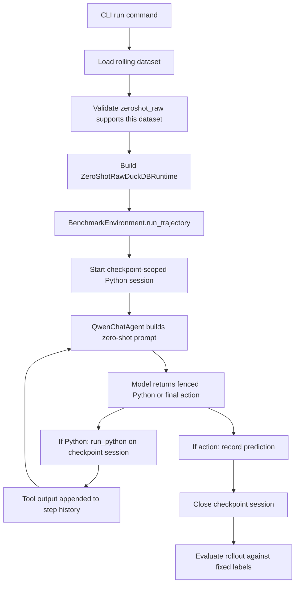

# Zero-Shot Raw Sepsis Pipeline Design

## Scope

This report organizes the current `zeroshot_raw` baseline pipeline for single-task sepsis monitoring.

It is meant to answer:

- what the current backend actually does
- how it differs from `official` and `autoformalized`
- what data and control flow each component owns
- where the current failure modes live

The relevant implementation lives in:

- runner and CLI: [src/sepsis_mvp/cli.py](/Users/chloe/Documents/New project/src/sepsis_mvp/cli.py)
- benchmark loop: [src/sepsis_mvp/environment.py](/Users/chloe/Documents/New project/src/sepsis_mvp/environment.py)
- agent/controller: [src/sepsis_mvp/agent.py](/Users/chloe/Documents/New project/src/sepsis_mvp/agent.py)
- runtime selection: [src/sepsis_mvp/tools.py](/Users/chloe/Documents/New project/src/sepsis_mvp/tools.py)
- zero-shot raw runtime: [src/sepsis_mvp/zeroshot_raw.py](/Users/chloe/Documents/New project/src/sepsis_mvp/zeroshot_raw.py)
- shared schema/task metadata: [src/sepsis_mvp/schemas.py](/Users/chloe/Documents/New project/src/sepsis_mvp/schemas.py)
- zero-shot guidance: [baseline/sepsis_guideline.yaml](/Users/chloe/Documents/New project/baseline/sepsis_guideline.yaml)

## Design Goal

The purpose of `zeroshot_raw` is to reuse the same rolling monitoring dataset and evaluation framework as the other backends, while removing access to derived MIMIC concept tables.

That means the baseline keeps:

- the same trajectory datasets
- the same checkpoint sequence
- the same step loop
- the same 3-way sepsis label space
- the same rollout and evaluation outputs

But it changes one major thing:

- instead of calling prebuilt concept tools, the model writes Python and SQL directly against checkpoint-scoped raw MIMIC tables

## Supported Scope Right Now

The current zero-shot backend is intentionally narrow.

It supports only:

- `--tool-backend zeroshot_raw`
- `--agent qwen`
- single-task sepsis trajectories

This restriction is enforced in [src/sepsis_mvp/cli.py](/Users/chloe/Documents/New project/src/sepsis_mvp/cli.py:114).

## High-Level Architecture

## Configuration Axes

The runner still has two independent axes:

- `task_mode`
  - `auto`
  - `single`
  - `multitask`
- `tool_backend`
  - `official`
  - `autoformalized`
  - `zeroshot_raw`

These are defined centrally in [src/sepsis_mvp/schemas.py](/Users/chloe/Documents/New project/src/sepsis_mvp/schemas.py:43).

For zero-shot raw, the active label space is still the ordinary single-task sepsis space:

- `keep_monitoring`
- `infection_suspect`
- `trigger_sepsis_alert`

## Dataset Layer

The zero-shot backend does not use a special dataset format.

It reuses the same rolling sepsis dataset and trajectory loader as the other backends:

- CSV or JSON trajectories are loaded by [src/sepsis_mvp/dataset.py](/Users/chloe/Documents/New project/src/sepsis_mvp/dataset.py)
- each trajectory carries:
  - `stay_id`
  - `hadm_id`
  - checkpoints
  - transition fields
  - task metadata

So the comparison across backends remains fair at the benchmark level:

- same stays
- same checkpoints
- same labels
- different evidence access layer

## Runtime Selection

Runtime selection happens in [src/sepsis_mvp/tools.py](/Users/chloe/Documents/New project/src/sepsis_mvp/tools.py:434).

The three backends differ as follows:

### `official`

- thin wrapper over `mimiciv_derived.*`
- returns compact tool-native JSON

### `autoformalized`

- loads generated Python concept functions
- exposes a checkpoint-scoped `query_db`
- adapts generated outputs back into tool-native JSON

### `zeroshot_raw`

- creates a checkpoint-scoped raw DuckDB environment
- exposes `run_python`
- lets the model write code directly

The key conceptual difference is that `zeroshot_raw` does not expose named sepsis tools like `query_sofa` or `query_suspicion_of_infection`. It exposes a code-execution primitive instead.

## Benchmark Environment Behavior

The main step loop is still owned by [src/sepsis_mvp/environment.py](/Users/chloe/Documents/New project/src/sepsis_mvp/environment.py).

For each checkpoint, the environment:

1. builds `AgentStepInput`
2. initializes empty step history
3. optionally starts a checkpoint session if the runtime supports it
4. loops over tool-call / action turns
5. records tool calls, tool outputs, and final action
6. closes the session

For `zeroshot_raw`, the key behavior is:

- if the runtime has `start_step_session`, the environment opens one per checkpoint
- if the tool call is `run_python`, the environment injects `session_id`
- history stores both the code sent and the result returned

This design keeps the outer evaluation loop unchanged while swapping the inner evidence-acquisition mechanism.

## Agent Step Input

The step input schema is defined in [src/sepsis_mvp/schemas.py](/Users/chloe/Documents/New project/src/sepsis_mvp/schemas.py:215).

For zero-shot raw, the most important fields are:

- `trajectory_id`
- `stay_id`
- `step_index`
- `t_hour`
- `task_names`
- `tool_backend`
- `max_step_interactions`

The zero-shot agent uses `max_step_interactions` as its per-checkpoint Python budget.

## Zero-Shot Prompt Construction

The zero-shot prompt builder lives in [src/sepsis_mvp/agent.py](/Users/chloe/Documents/New project/src/sepsis_mvp/agent.py:340).

It currently provides the model with:

- task framing: rolling monitoring, not forecasting
- current label space
- high-level clinical guidance for:
  - suspected infection
  - SOFA-style alerting
- execution contract
- allowed raw tables
- prior step history for the current checkpoint
- remaining Python execution budget
- guideline text from [baseline/sepsis_guideline.yaml](/Users/chloe/Documents/New project/baseline/sepsis_guideline.yaml)

The prompt now asks for:

- one fenced Python block for code execution
- or one JSON action object for a final decision

This is simpler than the earlier JSON-escaped-code format and was introduced to reduce output fragility.

## Output Parsing

Zero-shot response parsing lives in [src/sepsis_mvp/agent.py](/Users/chloe/Documents/New project/src/sepsis_mvp/agent.py:449).

The flow is:

1. strip `<think>` blocks
2. try to extract a fenced Python block
3. if code is found, map it to `run_python`
4. otherwise try to parse a JSON object
5. if JSON contains `action`, convert to `ActionDecision`

This is intentionally different from the regular tool-based agent path, which expects only JSON.

## Raw Runtime Design

The raw runtime is implemented in [src/sepsis_mvp/zeroshot_raw.py](/Users/chloe/Documents/New project/src/sepsis_mvp/zeroshot_raw.py).

Its key responsibilities are:

### 1. Validate required raw tables

On startup it checks for:

- `mimiciv_icu.icustays`
- `mimiciv_icu.chartevents`
- `mimiciv_icu.inputevents`
- `mimiciv_icu.outputevents`
- `mimiciv_icu.d_items`
- `mimiciv_hosp.admissions`
- `mimiciv_hosp.labevents`
- `mimiciv_hosp.d_labitems`
- `mimiciv_hosp.microbiologyevents`
- `mimiciv_hosp.prescriptions`

### 2. Build checkpoint-scoped views

For each step session it creates filtered views containing only data visible up to `visible_until`.

Examples:

- ICU `chartevents`: filtered by `stay_id` and `charttime <= visible_until`
- ICU `inputevents`: filtered by `stay_id` and `starttime <= visible_until`
- hospital `labevents`: filtered by `hadm_id` and `charttime <= visible_until`
- microbiology: filtered by `hadm_id` and `COALESCE(charttime, chartdate) <= visible_until`
- prescriptions: filtered by `hadm_id` and `starttime <= visible_until`

This is the main mechanism that turns raw MIMIC into a rolling monitoring task rather than a full-stay hindsight task.

### 3. Expose a safe namespace

The runtime preloads:

- `query_db(sql, params=None)`
- `stay_id`
- `subject_id`
- `hadm_id`
- `icu_intime`
- `visible_until`
- `t_hour`
- `pd`
- `np`
- `datetime`
- `timedelta`

It also restricts `query_db` to read-only SQL prefixes.

### 4. Execute code and summarize outputs

`run_python`:

- executes the code with `exec`
- captures `stdout` and `stderr`
- returns either:
  - `ok = true` with summarized `RESULT`
  - or `ok = false` with error type, message, and traceback

The runtime does not interpret the clinical meaning of the output. It simply executes and returns a summarized artifact.

## Event Trace Contract

The environment emits structured events such as:

- `trajectory_start`
- `step_start`
- `model_output_raw`
- `model_output_repair`
- `tool_call`
- `tool_output`
- `action`
- `trajectory_complete`

This is especially important for `zeroshot_raw`, because the event log is currently the best source of process-level interpretability.

It shows:

- what code the model wrote
- what errors came back
- whether retries were parser-related or execution-related
- whether the model eventually converged to an action

## Current Strengths

The current design already gets several important things right.

### 1. Fair outer benchmark

The dataset, checkpointing, and evaluation protocol remain aligned with the rest of the benchmark family.

### 2. Clear raw-vs-derived comparison

The backend isolates one experimental question cleanly:

- what happens when the model must discover concepts directly from raw MIMIC instead of consuming a derived abstraction

### 3. Good step-level instrumentation

Because code, outputs, and errors are all logged, the failure modes are much easier to inspect than ordinary end-only benchmark scores.

### 4. Strong temporal scoping

The runtime correctly prevents future leakage by filtering raw views to the current checkpoint.

## Current Weaknesses

The present backend is still an early experimental baseline and has several important weaknesses.

### 1. The agent can overbuild

The model often tries to recreate full sepsis logic in one large script rather than taking one small discovery step.

### 2. There is no pre-execution syntax guard

The controller does not currently compile code before passing it to `run_python`.

### 3. The parser is still permissive for incomplete code

If a code block is partially emitted, the current extractor may still treat it as executable code.

### 4. Error recovery is too generic

After syntax failure, the model often continues patching the oversized script rather than restarting with a smaller snippet.

### 5. The clinical search space is wide

The model must make many decisions from raw evidence:

- antibiotic logic
- culture timing
- itemid selection
- SOFA component logic
- temporal visibility semantics

That is a lot of hidden work for one checkpoint.

## What The Current Backend Is Best For

Right now the `zeroshot_raw` backend is best treated as:

- a stress test of raw clinical code generation
- a diagnostic baseline for why derived concept functions matter
- a process-analysis benchmark, not just a score benchmark

It is already informative even when it fails, because those failures show:

- what the model assumes from memory
- where the raw concept burden lies
- which controller guardrails are still missing

## Recommended Next Refinements

The current design is a solid baseline scaffold, but it needs stronger control around code execution.

The highest-value next steps are:

1. Reject open or obviously incomplete code blocks before execution.
2. Compile generated code inside the agent before calling `run_python`.
3. Add truncation-specific repair prompts that force a fresh short snippet.
4. Push the prompt harder toward one-query-at-a-time behavior.
5. Consider lightweight line-count or character-count limits for generated code.
6. Optionally add syntax-aware telemetry so failures can be bucketed automatically.

## Bottom Line

The current `zeroshot_raw` pipeline is structurally sound as a benchmark backend:

- same dataset
- same checkpointing
- same labels
- same evaluation

What changes is the evidence-access layer. That change is large enough to expose a real capability gap between:

- consuming a stable derived concept
- consuming a generated reusable concept function
- inventing and executing raw concept logic on the fly

That makes the backend valuable already, even though the current controller still needs stronger guardrails to prevent code-truncation loops.
